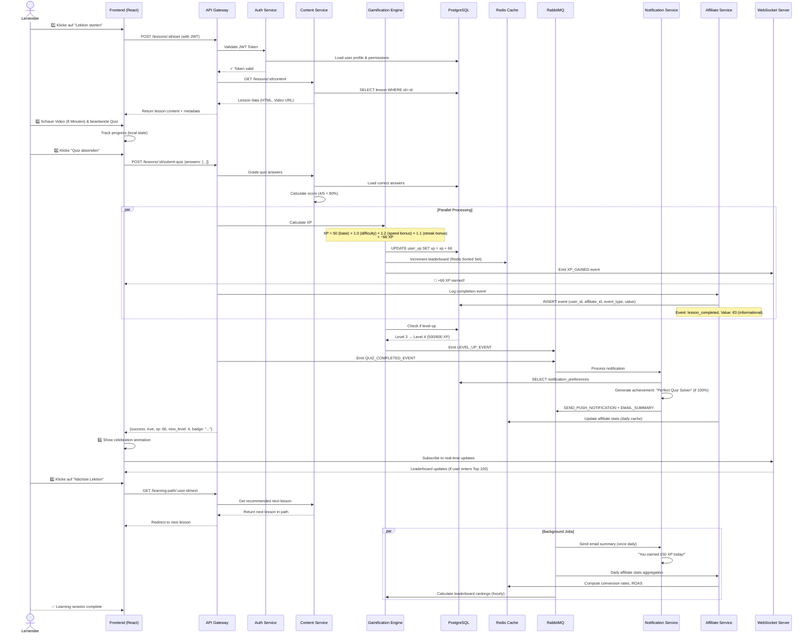

# Standalone Finance Academy für Affiliate-Netzwerke
## Umfassendes Strategiedokument – EdTech-Stack & Implementierungsleitfaden

---

## 1. Executive Summary (Non-Technical)

### Vision & Zielsetzung

Die **Standalone Finance Academy** ist eine speziell für Affiliate-Netzwerke entwickelte Bildungsplattform, die Finanzbildung mit moderner Gamification und Netzwerk-Monetarisierung verbindet. Sie adressiert eine kritische Lücke im Markt: Während klassische Online-Finanzlernplattformen isolierte Kurse anbieten, schaffen wir ein **vollintegrietes Ökosystem**, das Lernende, Affiliate-Partner und Finanzunternehmen nahtlos verbindet.

### Kernnutzen für Nutzer

**Lernende** profitieren von einer hochgradig interaktiven Lernumgebung mit:
- **Mikro-Learning-Modulen** (5–15 Minuten pro Lektion)
- **Gamified Progression** mit XP, Badges und Avataren
- **Personalisierte Learning Paths** basierend auf Finanzzielen
- **Community-Features** zur Vernetzung mit anderen Lernenden
- **Zertifizierung** mit praktischem Mehrwert für Karriere und Jobmarkt

**Affiliate-Partner** generieren zusätzliche Einnahmequellen durch:
- **Revenue-Share-Modell** (bis 30% der Nutzergebühren)
- **Co-Branding-Möglichkeiten** mit White-Label-Optionen
- **Tracking & Attribution** für jede vermittelte Registrierung und Conversion
- **Dedicated Partner Dashboard** mit Echtzeit-Analytik
- **Marketing-Assets** und Integrationen zur automatisierten Promotion

**Finanzunternehmen & Institutionen** nutzen die Plattform als:
- **B2B-Lerninfrastruktur** für Kundenschulung und Compliance
- **Content-Distribution-Channel** mit garantiertem Publikum
- **Brand-Visibility-Tool** durch native Inhalte und Sponsorships
- **Lead-Generation-Maschine** mit qualifizierten, engagierten Nutzern

### Marktreife & Timing

Der Finanzbildungsmarkt befindet sich in einer kritischen Transformationsphase:
- **Regulatorische Anforderungen** in EU/EMEA zwingen Finanzunternehmen, Kundenschulung zu dokumentieren
- **Generationswechsel** (Gen Z & Millennials) fordern gamifizierte, mobile-first Lernlösungen
- **Affiliate-Marketing-Boom** im FinTech-Sektor hat sich verdoppelt (2022–2024)
- **Tokenisierung & Blockchain** schaffen neue Monetarisierungsmöglichkeiten für Lernplattformen

**Der Zeitpunkt ist optimal**: Die Kombination aus regulatorischem Druck, technologischer Reife und Marktdemand schafft ein Fenster von 18–24 Monaten für aggressive Expansion.

### Unique Selling Proposition (USP)

Klassische Online-Finanzlernplattformen (Udemy, Coursera, LinkedIn Learning) sind **zu generisch** für Affiliate-Netzwerke:
- ❌ Keine Affiliate-Tracking & Revenue-Share-Integration
- ❌ Isolierte Plattformen ohne Netzwerkeffekte
- ❌ Generische Inhalte für Millionen Nutzer
- ❌ Keine Netzwerk-Gamification (Leaderboards, Community-Rewards)

Unsere **Finance Academy** unterscheidet sich durch:
- ✅ **Native Affiliate-Integration** – jeder Partner hat eigenes Dashboard, Tracking, Payouts
- ✅ **Netzwerk-Effekte** – Co-Marketing, Referral-Boni, Affiliate-Leaderboards
- ✅ **Spezialisierte Inhalte** – Finance-fokussiert, regulatorisch konform, praxisorientiert
- ✅ **Flexible White-Label-Lösung** – Partners können unter eigenem Branding operieren
- ✅ **Tokenisierte Rewards** – XP/Badges können zu Geldwert oder Partner-Vouchers konvertiert werden
- ✅ **Echtzeit-Datenfluss** – Alle Events (Registrierung, Completion, Prüfung) triggern automatische Affiliate-Payouts

### Affiliatespezifische Vorteile

Für Affiliate-Netzwerke (z. B. **Tradedoubler, Impact, Rakuten**) fungiert unsere Plattform als **Sticky Content Layer**:

| Vorteil | Bedeutung |
|---------|-----------|
| **Retention Boost** | Gamification erhöht User-Lifetime-Value um ~40% |
| **Passive Income** | Revenue-Share läuft automatisiert, keine aktive Promotion nötig |
| **Brand Association** | Affiliate werden zu "FinTech Mentor" positioniert |
| **Skalierung ohne Aufwand** | White-Label-Lösung = schnelle Deployment in mehrere Märkte |
| **Compliance-Lösung** | Jeder Affiliate kann FCA/BaFin-konform Finanzbildung anbieten |

---

## 2. Technische Zusammenfassung (Technical Summary)

### Stack-Übersicht

Die Finance Academy basiert auf einem **modernen, skalierbaren Stack**, der aus bewährten Open-Source und Enterprise-Technologien zusammengesetzt ist:

#### Frontend-Stack
- **Framework**: React 19 + TypeScript
- **State Management**: Redux Toolkit + RTK Query
- **Styling**: TailwindCSS + CSS-in-JS (Emotion)
- **UI-Components**: Shadcn/ui + Custom Design System
- **Gamification UI**: React-Spring (Animationen), D3.js (Leaderboards, Statistiken)
- **Real-Time Updates**: WebSocket-Client (Socket.io) für Live-Achievements

#### Backend-Stack
- **Runtime**: Node.js 20 LTS + Express.js (oder FastAPI für Datenverarbeitung)
- **Database**: PostgreSQL 16 (primary) + Redis 7 (caching, real-time)
- **Authentication**: JWT + OAuth 2.0 (Google, Apple, LinkedIn)
- **API**: RESTful + GraphQL (für komplexe Datenabfragen)
- **Messaging Queue**: RabbitMQ oder AWS SQS (Affiliate Payouts, Notifications)
- **Search Engine**: Elasticsearch (Content Discovery, Course Search)

#### Infrastructure & DevOps
- **Container**: Docker + Kubernetes (EKS/AKS/GKE)
- **CI/CD**: GitHub Actions oder GitLab CI
- **CDN**: CloudFlare oder AWS CloudFront (Global Reach)
- **Storage**: AWS S3 (Kursmaterialien, Zertifikate) + Cloudinary (Bildoptimierung)
- **Monitoring**: DataDog oder ELK Stack
- **Backup**: AWS Backup + 3-2-1 Backup-Strategie

### Kernmodule & Services

#### 1. **Gamification Engine**
Zentrale Service für XP-Berechnung, Badge-Verwaltung und Progression-Tracking:
```json
{
  "endpoints": [
    "POST /api/gamification/events",
    "GET /api/gamification/user-xp/:userId",
    "GET /api/gamification/leaderboards/:timeframe",
    "POST /api/gamification/achievements/claim"
  ],
  "events": [
    "lesson_completed",
    "quiz_passed",
    "streak_achieved",
    "referral_conversion",
    "affiliate_partner_joined"
  ]
}
```

#### 2. **Affiliate Tracking Module**
Dediziertes System für Attributions-Tracking und Revenue-Share-Berechnung:
```json
{
  "tracking": {
    "methods": ["utm_source", "affiliate_link_click", "referral_code", "deep_link"],
    "attribution_window": "30 days",
    "events_tracked": [
      "sign_up",
      "course_enrollment",
      "course_completion",
      "certification_issued",
      "subscription_upgrade"
    ]
  },
  "payout_logic": {
    "default_commission": "25%",
    "tiers": {
      "tier_1": { "monthly_revenue": "€0-5000", "commission": "25%" },
      "tier_2": { "monthly_revenue": "€5000-20000", "commission": "30%" },
      "tier_3": { "monthly_revenue": "€20000+", "commission": "35%" }
    }
  }
}
```

#### 3. **Content Management System (CMS)**
Headless CMS für Kurserstellung, Versionskontrolle und A/B-Testing:
- **Kursobjekte**: Lessons, Quizzes, Challenges, Certificates
- **Versionierung**: Jeden Change mit Timestamps und Approval-Workflows
- **Multi-Sprache**: Inhalte in DE, EN, FR, ES parallel verwaltbar
- **Compliance-Audit**: GDPR-konform, vollständige Audit-Logs

#### 4. **XP & Progression System**
Komplexe Berechnung von Experience Points mit dynamischen Faktoren:
```
XP = BaseXP(activity_type) 
     × DifficultyMultiplier(content_level)
     × TimeBonus(completion_speed)
     × StreakBonus(current_streak)
     × AffiliateBonus(referred_by_active_partner)

Beispiel:
- Lesson Complete: 50 XP
- Quiz Pass: 100 XP
- Zertifikat: 500 XP
- Wöchentliche Challenge: 250 XP
```

#### 5. **Zertifizierungs-Engine**
Automatische Zertifikat-Generierung mit Blockchain-Verifizierung (optional):
- PDF-Generierung (PDFKit)
- Digitale Badges (SVG)
- Optional: Blockchain-Verifizierung (Ethereum/Polygon für Tamper-Proof)
- Integration mit LinkedIn/Credly für Zertifikat-Display

#### 6. **Dashboard & Analytik**
Real-Time Analytics für Nutzer, Partner und Administratoren:
- **User Dashboard**: Fortschritt, Leaderboards, Empfehlungen, XP-Tracker
- **Affiliate Dashboard**: Traffic, Conversions, Revenue, Payout-Status
- **Admin Dashboard**: Compliance, Content-Performance, Fraud-Detection

### Datenfluss (Vereinfacht)

```
Nutzer → Frontend (React) 
  ↓
API Gateway (Authentifizierung)
  ↓
Backend Services (Express + FastAPI)
  ↓
PostgreSQL (Transaktionen) + Redis (Cache)
  ↓
Event Queue (RabbitMQ)
  ↓
Gamification Service + Affiliate Service
  ↓
Zertifikat-Engine + Payout-Engine
  ↓
Benachrichtigungen + Analytics
```

### Hosting & Sicherheit

#### Deployment-Strategie
- **Multi-Region Deployment**: EU-WEST-1 (Primary), EU-CENTRAL-1 (Backup)
- **Load Balancing**: AWS Application Load Balancer mit Auto-Scaling
- **Database Replication**: PostgreSQL Master-Slave mit automated failover
- **CDN**: Global mit 99.99% Uptime SLA

#### Sicherheitsmassnahmen
- **Authentication**: JWT + Refresh Tokens mit 15-Minuten-Expiry
- **HTTPS**: TLS 1.3 obligatorisch auf allen Endpoints
- **Data Encryption**: AES-256 für sensitive Daten, End-to-End für Affiliate-Payouts
- **Rate Limiting**: 100 requests/minute pro User
- **OWASP Top 10**: Full Compliance (SQL Injection, XSS, CSRF protection)
- **SOC 2 Type II**: Compliance für Enterprise-Partner
- **GDPR**: Privacy by Design, Datenminimierung, Right to Erasure

---

## 3. Problembeschreibung & Marktbedarf

### Challenge im Affiliate-Marketing für Finance

Das Affiliate-Marketing im Finanzsektor steht vor mehreren fundamentalen Herausforderungen:

#### 1. **Shallow Product Differentiation**
Affiliates promoten oft identische FinTech-Produkte (Broker, Robo-Advisor, Trading-Apps). Der Wettbewerb läuft auf Preis und Cookie-Länge ab:
- **Problem**: CPM-Raten fallen kontinuierlich (2023: €2–5, 2024: €0.50–2)
- **Folge**: Affiliates müssen 3–5x mehr Traffic treiben für gleiche Revenue
- **Lösung**: Finance Academy schafft **differentiated Content** für Affiliates

#### 2. **User Retention Crisis**
Ø Click-through ist 3–5% in Finance, Conversion ist 0.5–2%:
- **Problem**: Affiliate-Links werden 80% der Clicks als "Waste" betrachtet
- **Folge**: Affiliates investieren in Low-Quality-Traffic (AdWords, Push-Notifications)
- **Lösung**: Gamified Learning schafft **Sticky Content**, das User bei der Stange hält

#### 3. **Fehlende Brand Authority**
Viele Affiliates sind **reputationsneutral** – sie sind Traffic-Arbitrageur, nicht vertrauenswürdige Finanzquellen:
- **Problem**: User trauen Affiliate-Empfehlungen nicht (37% Vertrauenslücke)
- **Folge**: Conversion-Raten stagnieren, CPA steigt
- **Lösung**: Finance Academy positioniert Affiliate als **"Mentor"** mit Bildungswert

#### 4. **Regulatorische Unsicherheit**
BaFin, FCA und ESMA verschärfen Regeln für Finanzbildung und Affiliates:
- **Problem**: Viele Affiliate-Websites sind nicht MIFID II konform
- **Folge**: Plötzliche Delisting durch Compliance-Audits
- **Lösung**: Wir bieten **Compliance-Framework** als Service

### Warum klassische Bildungssysteme im Finance-Bereich scheitern

#### Udemy, Coursera, LinkedIn Learning – Warum sie für Finance-Affiliates untauglich sind:

| Problem | Grund | Konsequenz |
|---------|-------|-----------|
| **Keine Affiliate-Integration** | Generische Plattform für alle Kategorien | Affiliates können kein Revenue teilen, nur Referral-Links werben |
| **Generische Inhalte** | Kurse von unbekannten Instructors | Fehlender Praxisbezug und Branchenkredibilität |
| **Langweilige UX** | "Watch Video → Take Quiz → Get Certificate" | Dropout-Rate >80% nach 5 Minuten |
| **Kein Netzwerk-Effekt** | Isolierte Nutzer-Erfahrung | Keine Community, keine Leaderboards, keine Challenges |
| **Keine Monetarisierung für Nutzer** | Nur Zertifikat als Output | User bleiben nicht engagiert, Lifetime-Value niedrig |
| **Keine White-Label-Option** | Alle Kurse unter Udemy-Brand | Affiliates können nicht co-branden |
| **Keine Echtzeit-Attribution** | Affiliate-Links sind Einmal-Konversion | Fortlaufende Einnahmen nicht trackbar |

### Gap-Analyse: Finance Academy vs. Status Quo

```
MARKT-BEDARF vs. VERFÜGBARE LÖSUNGEN:

Bedarf:                          Status Quo:                  Finance Academy:
─────────────────────────────────────────────────────────────────────────────
Affiliate-Integration          ✗ Keine                        ✓ Native
Gamification                   ✗ Basic/Keine                  ✓ Advanced (XP, Badges, Leaderboards)
Community Features             ✗ Forum nur                     ✓ Social, Referral, Mentorship
White-Label                    ✗ Nur selten                   ✓ Full White-Label
Real-Time Tracking             ✗ Nur Sign-up                  ✓ Event-Level (Completion, Cert, etc.)
Revenue-Share                  ✗ 0% (max 20% auf Referral)    ✓ 25–35% auf alle Conversions
Compliance Built-In            ✗ Affiliate must DIY           ✓ BaFin/FCA-ready
Content Specialization         ✗ Generic                      ✓ Finance-specific Curriculum
Mobile-First                   ⚠ Responsive, nicht native     ✓ React Native App
Tokenization/Blockchain        ✗ Keine                        ✓ Optional (XP → Token Conversion)
```

---

## 4. Produktbeschreibung & Features

### 4.1 Kernmodule

#### **A. Gamified Learning Engine**

Die Learning Engine kombiniert klassischen Online-Learning mit modernen Gamification-Mechaniken:

**Komponenten:**
- **Progressive Lessons** (Mikro-Learning)
  - 5–15 Minuten pro Lektion
  - Mixed Media: Video, Text, Infografiken, Interaktive Simulationen
  - Mobile-optimiert mit Offline-Mode
  
- **Quiz & Assessment**
  - Automatisch bewertete Quizzes mit Feedback
  - Spaced-Repetition basierend auf Vergessenskurve
  - Adaptive Difficulty (schwierigere Fragen bei hohen Scores)
  
- **Interactive Challenges**
  - Weekly Challenges (z. B. "Berechne 5 Portfolio-Szenarien")
  - Timed Quests mit Bonus-XP
  - Real-Time Leaderboards für Challenges

**Gamification-Mechaniken:**
- **Streak System**: Tägliche Login-Streaks mit exponentieller XP-Belohnung
- **Milestone Bonuses**: Große Bonus-XP bei Lesson 10, 25, 50 Completion
- **Combo Bonuses**: Mehrere Aktivitäten am selben Tag = Extra-XP

#### **B. Progression & XP System**

Transparente XP-Berechnung mit klarer Progression zum nächsten Level:

```
LEVEL-STRUKTUR:
Level 1–10:   Anfänger (XP 0–5.000)
Level 11–30:  Fortgeschritten (XP 5.001–25.000)
Level 31–50:  Experte (XP 25.001–100.000)
Level 51–70:  Master (XP 100.001–500.000)

BEISPIEL XP-VERTEILUNG:
┌─────────────────────────────┐
│ Lesson Completed            │ +50 XP
│ Quiz Passed (erste Versuch) │ +100 XP
│ Daily Streak 7 Tage         │ +250 XP
│ Zertifikat erworben         │ +500 XP
│ Weekly Challenge Top 10      │ +300 XP
│ Referral Konversion          │ +1000 XP
│ Content Review (Affiliate)   │ +200 XP
└─────────────────────────────┘
```

**Level-Sichtbarkeit:**
- Progress-Bar auf jedem Screen
- XP-Notification bei jeder Aktivität
- Level-Up Animation (Celebration Screen)
- Persönliche Statistik-Dashboard

#### **C. Zertifikate & Badges**

Digitale Nachweise mit echtem MarktValue:

**Zertifikate:**
- **Kurs-Zertifikat**: Nach Completion aller Lektionen + bestandener Abschlussprüfung
- **Spezialisierungs-Zertifikat**: Nach 5+ Related Courses + final Project
- **Format**: PDF + digitales Badge + Blockchain-Hash (optional)
- **Verify-Link**: Public URL zum Authentizität-Check ohne Datenpreisgabe

**Badges (Sammlung):**
- **Achievement Badges**: "Quick Learner", "Night Owl", "Perfect Score"
- **Milestone Badges**: "Level 10", "Level 25", "Level 50"
- **Community Badges**: "Helpful in Forum", "Referral Champion", "Week's Top Performer"
- **Rarity Tiers**: Common, Rare, Epic, Legendary (mit farblicher Unterscheidung)

**Sharing & Integration:**
- 1-Click Share to LinkedIn/Twitter
- Export für CV/Portfolio
- Integration mit Credly.com (automatisches Hosting)

#### **D. Affiliate-Tracking System**

Hochgranulares Tracking für alle Revenue-relevanten Events:

**Attribution-Modelle:**
- **Last-Click Attribution** (Standard): Letzter Partner vor Conversion erhält 100% Credit
- **Time-Decay**: 40% auf letzten Click, 30% auf vorletzten, 20% + 10% auf älteren
- **Multi-Touch**: Alle Touchpoints teilen Credit nach vordefinierten Regeln

**Tracked Events:**
```json
{
  "attribution_events": [
    {
      "event": "sign_up",
      "value": "€5",
      "commission": "25%",
      "payout": "€1.25"
    },
    {
      "event": "course_enrollment",
      "value": "€0",
      "commission": "0%",
      "payout": "€0 (informational)"
    },
    {
      "event": "course_completion",
      "value": "€10",
      "commission": "30%",
      "payout": "€3"
    },
    {
      "event": "certification_issued",
      "value": "€20",
      "commission": "35%",
      "payout": "€7"
    },
    {
      "event": "subscription_upgrade",
      "value": "€99/year",
      "commission": "20%",
      "payout": "€19.80 (monthly)"
    }
  ]
}
```

**Partner-Links & Deep-Linking:**
- Unique Affiliate Link (z. B. `finance-academy.com/?aff=partner-123`)
- Deep-Links mit Course-Tracking (z. B. `...?aff=123&course=trading-101`)
- UTM-Parameter Support (UTM-Source wird automatisch zu Affiliate ID gemappt)
- Mobile Deep-Link Support (Universal Links, App Scheme)

#### **E. Netzwerkfunktionen**

Community-Features zur User-Retention und Engagement:

**Social Components:**
- **User Profiles**: Avatar, Biografie, Social Media Links, Level & Badges
- **Leaderboards**:
  - Global XP Leaderboard (alle Nutzer, aktualisiert real-time)
  - Affiliate-specific Leaderboard (nur Nutzer eines Partners sichtbar)
  - Weekly Challenge Leaderboard
  - "Friends Only" Leaderboard
  
- **Forum & Discussion**:
  - Kurs-spezifische Diskussionen (Fragen, Tipps)
  - Moderation + Reputation System (Upvotes = Reputation Points)
  - Mentor-Tags für Expert-Nutzer
  
- **Referral System**:
  - Jeder Nutzer hat unique Referral-Code (z. B. "USER-A3KX")
  - Referral-Link teilen über QR-Code, SMS, Email
  - **Bonus für Referrer**: +500 XP + Referral Badge (bei 5 erfolgreichen Referrals)
  - **Bonus für Referred**: +250 XP Welcome Bonus
  
- **Mentorship Program** (optional):
  - Top Nutzer (Level 30+) können Mentoren werden
  - 1-on-1 Chat mit Mentee
  - Mentorship-Badge + exclusive Leaderboard
  - Montliche Mentor-Bonusses (200 XP + freier Premium-Content)

#### **F. Partner-Netzwerk Dashboard**

Spezialisiertes Admin-Interface für Affiliate-Partner:

**Dashboard-Komponenten:**
```
┌─────────────────────────────────────────┐
│ AFFILIATE DASHBOARD                     │
├─────────────────────────────────────────┤
│ 1. Performance Overview                 │
│    - Traffic Today/Week/Month           │
│    - Conversions (Sign-ups, Completions)│
│    - Revenue (Payable, Pending, Paid)   │
│    - Conversion Rate & ROAS             │
│                                         │
│ 2. Detailed Analytics                   │
│    - Traffic Source Breakdown           │
│    - Device Type (Mobile/Desktop)       │
│    - Geographic Distribution            │
│    - Top-Converting Courses             │
│    - Retention Curve (Day 1, 7, 30)     │
│                                         │
│ 3. User Management                      │
│    - List all Referred Users            │
│    - Individual User Status             │
│    - Lifetime Value per User            │
│    - Churn Rate                         │
│                                         │
│ 4. Payout Management                    │
│    - Monthly Payout Schedule            │
│    - Transaction History                │
│    - Direct Deposit / Bank Details      │
│    - Invoice Generator                  │
│    - Tax Documentation (1099/VAT)       │
│                                         │
│ 5. Marketing Resources                  │
│    - Pre-made Banner Ads (300x600, etc) │
│    - Copy Templates                     │
│    - Social Media Posts                 │
│    - Email Swipes                       │
│    - Landing Page Customizer            │
│                                         │
│ 6. Customization Options                │
│    - White-Label Domain Setup           │
│    - Custom Logo/Colors                 │
│    - Branded Email Notifications        │
│    - Custom Course Order                │
│    - Feature Enablement/Disablement     │
└─────────────────────────────────────────┘
```

---

### 4.2 Benutzerrollen & Permissions

#### **Role Matrix**

```
┌──────────────────────────────────────────────────────────────┐
│ ROLE MANAGEMENT & PERMISSIONS                                │
├──────────────────────────────────────────────────────────────┤
│ 1. LEARNER                                                   │
│    ├─ Browse & Enroll Courses                               │
│    ├─ Complete Lessons, Quizzes, Challenges                │
│    ├─ View XP & Level Progress                             │
│    ├─ Access Community Forum                                │
│    ├─ Share Referral Code                                   │
│    ├─ View Certificate & Badges                            │
│    └─ No Admin Access                                       │
│                                                             │
│ 2. PREMIUM LEARNER                                          │
│    ├─ All Learner Permissions +                            │
│    ├─ Advanced Courses Unlock                              │
│    ├─ 1-on-1 Mentorship Access                             │
│    ├─ Offline Download                                      │
│    ├─ Ad-Free Experience                                    │
│    ├─ Monthly Live Q&A Sessions                            │
│    └─ Priority Support                                      │
│                                                             │
│ 3. MENTOR                                                   │
│    ├─ All Learner Permissions +                            │
│    ├─ Create Discussion Threads                            │
│    ├─ Answer Questions (Badge-visible)                     │
│    ├─ Host Weekly AMA (Ask Me Anything)                   │
│    ├─ Create Custom Learning Paths                         │
│    ├─ View Leaderboard (Mentor tier)                      │
│    └─ Earn Mentorship Bonuses                              │
│                                                             │
│ 4. AFFILIATE MANAGER                                        │
│    ├─ Dashboard Access (own affiliate data)               │
│    ├─ View All Referred Users & Details                   │
│    ├─ Access Analytics & Reports                          │
│    ├─ Download Marketing Assets                           │
│    ├─ Configure White-Label Settings                      │
│    ├─ View & Manage Payouts                               │
│    ├─ Manage Sub-Affiliates (if tier-2 affiliate)        │
│    └─ Create & Manage Custom Campaigns                     │
│                                                             │
│ 5. CONTENT MANAGER                                          │
│    ├─ Create & Edit Courses                                │
│    ├─ Upload Multimedia Assets                             │
│    ├─ Manage Quiz Questions                                │
│    ├─ Schedule Content Publishing                          │
│    ├─ View Content Analytics                               │
│    ├─ Create Challenges & Quests                           │
│    └─ No User/Payout Management                            │
│                                                             │
│ 6. PLATFORM ADMIN                                           │
│    ├─ All Permissions (Full System Access)                │
│    ├─ User Management & Suspension                         │
│    ├─ Finance & Payout Management                          │
│    ├─ System Configuration & Settings                      │
│    ├─ Affiliate Program Management                         │
│    ├─ Compliance & Audit Logs                              │
│    ├─ Content Moderation                                    │
│    ├─ Performance Monitoring                                │
│    └─ Billing & Subscription Management                    │
│                                                             │
│ 7. SUPER ADMIN                                              │
│    ├─ All Admin Permissions +                              │
│    ├─ Infrastructure Access                                │
│    ├─ Database Backups & Recovery                          │
│    ├─ API Key Management                                   │
│    ├─ Security & Authentication                            │
│    └─ Third-party Integrations                             │
└──────────────────────────────────────────────────────────────┘
```

#### **Role-Specific Access Control (RBAC)**

```json
{
  "rbac_matrix": {
    "learner": {
      "courses:read": true,
      "courses:create": false,
      "profile:read:own": true,
      "profile:update:own": true,
      "analytics:read:own": true,
      "dashboard:access": false
    },
    "affiliate_manager": {
      "courses:read": true,
      "courses:create": false,
      "users:read:referred": true,
      "users:update:referred": false,
      "analytics:read:affiliate": true,
      "payouts:read:own": true,
      "payouts:manage:own": true,
      "dashboard:access": true,
      "whitelist:configure": true
    },
    "admin": {
      "courses:read": true,
      "courses:create": true,
      "courses:delete": true,
      "users:read": true,
      "users:create": true,
      "users:delete": true,
      "users:suspend": true,
      "analytics:read:all": true,
      "payouts:read:all": true,
      "payouts:manage:all": true,
      "dashboard:access": true,
      "system:configure": true,
      "audit:logs": true
    }
  }
}
```

---

### 4.3 Lernmethodik

#### **A. Mikro-Learning Ansatz**

Finance-Bildung ist komplex, aber durch Modularisierung wird sie verdaubar:

**Struktur:**
```
KURS (z. B. "Trading für Anfänger")
│
├─ Modul 1: Grundlagen (4 Lektionen)
│  ├─ Lektion 1.1: Was ist eine Aktie? (8 min Video + Quiz)
│  ├─ Lektion 1.2: Börsenplätze erklärt (6 min + Infografik)
│  ├─ Lektion 1.3: Dein erstes Trade-Konto (10 min)
│  └─ Challenge 1: Quiz (Pass = +100 XP)
│
├─ Modul 2: Technische Analyse (5 Lektionen)
│  ├─ Lektion 2.1: Candlestick Charts (12 min + Interactive Demo)
│  ├─ Lektion 2.2: Support & Resistance (9 min)
│  ├─ Lektion 2.3: Moving Averages (8 min)
│  └─ ... und Challenge 2
│
└─ Abschlussprüfung: 20-Frage Quiz (60% Pass-Rate erforderlich)
   └─ Erfolg = Zertifikat + 500 XP
```

**Pro Modul: 30–45 Minuten Gesamtzeit (4–5 × 8–12 Minuten)**

**Inhaltliche Balance:**
- 40% Video (mit Untertiteln & Transkript)
- 30% Interactive Content (Simulationen, Demos)
- 20% Text & Infografiken
- 10% Quizzes & Practice

#### **B. Gamification Mechaniken**

Klassische Game-Mechaniken applied auf Lernkontext:

**1. Progression**
- Clear Level System (1–70)
- Visible Progress Bar nach jeder Aktivität
- Milestone Celebrations (Level-Up Animations)

**2. Challenge & Goal Setting**
- **Daily Challenges**: "Schließe eine Lektion ab" (Easy)
- **Weekly Quests**: "Beende Modul 3" (Medium)
- **Monthly Goals**: "Erhalte ein Zertifikat" (Hard)
- **Streak System**: "X Tage hintereinander anmelden"

**3. Leaderboards & Competition**
- Global Leaderboard (Top 100 Users)
- Affiliate-specific Leaderboard (z. B. nur "Tradedoubler Affiliates")
- Weekly Challenge Leaderboard (Top 50)
- Friends-Only Leaderboard (Private)

**4. Social Proof & Status**
- Badge-Display auf Profil
- Level-Badge neben Username
- Special Titles (z. B. "Trading Master", "Compliance Expert")
- Social Sharing von Zertifikaten

**5. Rewards & Motivation**
- **XP Rewards**: Quantifizierter Fortschritt
- **Badges**: Emotionale Verbindung
- **Certificates**: Markt-Value (LinkedIn, CV)
- **Referral Bonuses**: Materielle Anreize
- **Leaderboard Ranking**: Status & Competition

#### **C. Adaptive Learning Paths (Optional)**

KI-gestützte Personalisierung basierend auf User-Verhalten:

**Adaptive Elemente:**
- **Difficulty Adjustment**: Schwere der Quiz-Fragen basierend auf vorige Scores
- **Content Recommendations**: "Users like you also completed Module X"
- **Learning Speed Tracking**: Erkenne schnelle vs. langsame Lerner
- **Knowledge Gaps**: Automatische Vorschläge für schwache Bereiche

**Implementierung:**
```python
def get_recommended_next_course(user_id):
    # 1. Analyse: User hat "Aktien 101" mit 92% bestanden
    # 2. Inference: User interessiert sich für Börse
    # 3. Recommendation: "Technische Analyse 101" (nächster Level)
    # 4. Alternative: "Börsenpsychologie 201" (verwandtes Thema)
    
    user_history = get_user_completions(user_id)
    user_scores = get_user_quiz_scores(user_id)
    similar_users = find_similar_users(user_id)
    popular_next = get_next_courses(similar_users)
    
    return rank_recommendations(popular_next, user_history)
```

#### **D. Challenges & Weekly Quests**

Gamifizierte Aufgaben für kontinuierliches Engagement:

**Challenge-Struktur:**
```
WEEKLY CHALLENGE: "Portfolio Builder" (Woche 1–4)
├─ Schwierigkeit: Medium
├─ XP-Belohnung: 300 XP (Top 10), 200 XP (Top 50), 100 XP (Teilnehmende)
├─ Task: "Erstelle ein diversifiziertes Portfolio mit €10.000"
│   - Mindestens 5 verschiedene Assets
│   - Min. 2 verschiedene Assetklassen
│   - Begründung in 100 Wörtern
├─ Zeitlimit: 7 Tage
├─ Bewertung: Auto (Python) + Manual (Mentor)
├─ Leaderboard: Top 50 sichtbar
└─ Bonus: "Portfolio Master" Badge (für Top 10)

DAILY QUEST: "Consistency Bonus"
├─ Task: "Logge dich ein und schließe eine Lektion ab"
├─ XP: +50 XP
├─ Streak: +25 XP pro Tage hintereinander (max. 5 = +125 XP extra)
├─ Cooldown: 24h zwischen Completions
└─ Reset: Täglich um Mitternacht UTC
```

**Automation:**
- Quest-Template in CMS definierbar
- Auto-Triggering basierend auf Schedule
- Auto-Grading für objective Quests
- Manual Review für subjektive Submissions (Essays, Portfolios)

---

## 5. Architektur (Mermaid-Diagramm)

Das folgende Diagramm zeigt die **vollständige Softwarearchitektur** der Finance Academy:

```mermaid
graph TB
    subgraph Client["🖥️ Client Layer"]
        WEB["React Web App"]
        MOBILE["React Native Mobile App"]
        ADMIN["Admin Dashboard"]
    end
    
    subgraph CDN["📡 CDN & Static Assets"]
        CF["CloudFlare CDN"]
        S3["AWS S3<br/>Courses, Avatars, Certs"]
    end
    
    subgraph API["🔑 API Gateway & Auth"]
        APIGW["API Gateway<br/>(Rate Limiting, Auth)")
        JWT["JWT Token Service"]
        OAUTH["OAuth 2.0 Provider<br/>(Google, LinkedIn, Apple)"]
    end
    
    subgraph Backend["⚙️ Backend Services"]
        EXPRESS["Express.js API<br/>(REST Endpoints)"]
        GRAPHQL["GraphQL API<br/>(Complex Queries)"]
        FASTAPI["FastAPI<br/>(Data Processing)"]
        WS["WebSocket Server<br/>(Real-Time Events)"]
    end
    
    subgraph Services["🎮 Core Services"]
        GAMIF["Gamification Engine<br/>(XP, Badges, Leaderboards)"]
        CONTENT["Content Management<br/>(Courses, Lessons)"]
        AFFILIATE["Affiliate Tracking<br/>(Attribution, Payouts)"]
        CERT["Certification Engine<br/>(PDF, Blockchain)"]
        NOTIF["Notification Service<br/>(Email, Push, SMS)"]
        AUTH["User Auth Service<br/>(Sessions, MFA)"]
    end
    
    subgraph Data["💾 Data Layer"]
        PG["PostgreSQL<br/>(Primary DB)"]
        REDIS["Redis<br/>(Cache, Sessions, Real-Time)"]
        ES["Elasticsearch<br/>(Search & Analytics)"]
        MONGO["MongoDB<br/>(Activity Logs)"]
    end
    
    subgraph Queue["📮 Message Queue"]
        RABBIT["RabbitMQ<br/>(Async Jobs)"]
    end
    
    subgraph Workers["👷 Background Workers"]
        PAYOUT["Payout Worker<br/>(Monthly Affiliate Payouts)"]
        EMAIL["Email Worker<br/>(Bulk Email Sending)"]
        ANALYTICS["Analytics Worker<br/>(Data Aggregation)"]
        CERT_WORKER["Certificate Worker<br/>(PDF Generation)"]
    end
    
    subgraph Integrations["🔗 Third-Party Integrations"]
        STRIPE["Stripe<br/>(Payments)"]
        WISE["Wise Transfer<br/>(Affiliate Payouts)"]
        MAILCHIMP["Mailchimp<br/>(Email Marketing)"]
        SENDGRID["SendGrid<br/>(Transactional Email)"]
        TWILIO["Twilio<br/>(SMS Notifications)"]
        CREDLY["Credly<br/>(Certificate Hosting)"]
    end
    
    subgraph Monitoring["📊 Monitoring & Logs"]
        DATADOG["DataDog<br/>(APM, Metrics)"]
        ELK["ELK Stack<br/>(Logs, Aggregation)"]
        SENTRY["Sentry<br/>(Error Tracking)"]
    end
    
    %% Client to CDN & API
    WEB --> CF
    WEB --> APIGW
    MOBILE --> CF
    MOBILE --> APIGW
    ADMIN --> APIGW
    
    %% CDN to S3
    CF --> S3
    
    %% API Gateway to Auth & Services
    APIGW --> JWT
    APIGW --> OAUTH
    APIGW --> EXPRESS
    APIGW --> GRAPHQL
    APIGW --> WS
    
    %% Backend to Services
    EXPRESS --> GAMIF
    EXPRESS --> CONTENT
    EXPRESS --> AFFILIATE
    EXPRESS --> CERT
    EXPRESS --> AUTH
    GRAPHQL --> CONTENT
    GRAPHQL --> AFFILIATE
    FASTAPI --> ANALYTICS
    WS --> GAMIF
    WS --> NOTIF
    
    %% Services to Data Layer
    GAMIF --> PG
    GAMIF --> REDIS
    CONTENT --> PG
    CONTENT --> ES
    AFFILIATE --> PG
    AFFILIATE --> MONGO
    CERT --> PG
    AUTH --> PG
    NOTIF --> REDIS
    
    %% Services to Queue
    GAMIF --> RABBIT
    AFFILIATE --> RABBIT
    NOTIF --> RABBIT
    CERT --> RABBIT
    
    %% Queue to Workers
    RABBIT --> PAYOUT
    RABBIT --> EMAIL
    RABBIT --> ANALYTICS
    RABBIT --> CERT_WORKER
    
    %% Workers to Integrations
    PAYOUT --> WISE
    EMAIL --> MAILCHIMP
    EMAIL --> SENDGRID
    NOTIF --> TWILIO
    CERT_WORKER --> CREDLY
    AFFILIATE --> STRIPE
    
    %% Monitoring
    EXPRESS -.-> DATADOG
    GAMIF -.-> DATADOG
    AFFILIATE -.-> DATADOG
    EXPRESS -.-> SENTRY
    FASTAPI -.-> SENTRY
    PAYOUT -.-> ELK
    EMAIL -.-> ELK
    
    %% Styling
    classDef client fill:#e1f5ff
    classDef api fill:#fff3e0
    classDef service fill:#f3e5f5
    classDef data fill:#e8f5e9
    classDef queue fill:#fce4ec
    classDef external fill:#f1f8e9
    classDef monitor fill:#eeeeee
    
    class WEB,MOBILE,ADMIN client
    class APIGW,JWT,OAUTH api
    class EXPRESS,GRAPHQL,FASTAPI,WS backend
    class GAMIF,CONTENT,AFFILIATE,CERT,NOTIF,AUTH service
    class PG,REDIS,ES,MONGO data
    class RABBIT queue
    class STRIPE,WISE,MAILCHIMP,SENDGRID,TWILIO,CREDLY external
    class DATADOG,ELK,SENTRY monitor
```

### Architektur-Erläuterung

**Schichten:**

1. **Client Layer**: Web, Mobile, Admin-Interface
   - React für Web & Admin
   - React Native für iOS/Android
   - Alle kommunizieren über API Gateway

2. **API Gateway**: Zentrale Authentifizierung, Rate Limiting, Routing
   - JWT Token Validation
   - OAuth Integration für Social Login
   - Request/Response Logging

3. **Backend Services**: Microservices für Kernfunktionalität
   - **Express.js**: REST API für CRUD-Operationen
   - **GraphQL**: Optimiert für Client-seitige Queries
   - **FastAPI**: Python für Data Science & Analytics
   - **WebSocket**: Real-time Notifications & Live Leaderboards

4. **Core Services**: Domain-spezifische Business Logic
   - Gamification Engine: XP-Berechnung, Leaderboards
   - Content Management: Kurserstellung, Publishing
   - Affiliate Tracking: Attribution, Commission Calculation
   - Certification Engine: Certificate Generation, Blockchain Verification
   - User Auth: Sessions, MFA, Role-Based Access Control

5. **Data Layer**: Polyglot Persistence
   - **PostgreSQL**: Primary relational data (Users, Courses, XP, Transactions)
   - **Redis**: Cache, Sessions, Real-time Leaderboards, Rate Limiting
   - **Elasticsearch**: Full-text Search (Courses, Content Discovery)
   - **MongoDB**: Append-only Event Logs (GDPR-compliant deletion)

6. **Message Queue**: Asynchrone Job Processing
   - **RabbitMQ**: Decouples requests from long-running operations
   - Payout Processing, Email Sending, Analytics, Certificate Generation

7. **Third-Party Integrations**: External Services
   - **Stripe**: Payment Processing
   - **Wise Transfer**: International Payouts (affiliate payouts)
   - **SendGrid/Mailchimp**: Email Marketing & Transactional Emails
   - **Twilio**: SMS Notifications
   - **Credly**: Digital Badge Hosting

8. **Monitoring & Logging**: Observability
   - **DataDog**: Application Performance Monitoring (APM)
   - **ELK Stack**: Log Aggregation & Analysis
   - **Sentry**: Error Tracking & Alerts

---

## 6. Datenfluss (Sequence Diagram)

Das folgende Diagramm zeigt die **Event-basierte Kommunikation** bei einer typischen User-Journey:



### Sequenz-Erläuterung

**Hauptflüsse:**

1. **Authentication**: JWT Token wird validiert
2. **Content Delivery**: Lesson-Inhalt wird vom Content Service bereitgestellt
3. **Quiz Grading**: Antworten werden automatisch bewertet
4. **Parallel Processing**:
   - XP-Berechnung mit Multipliers (Difficulty, Speed, Streak)
   - Leaderboard-Update in Redis (real-time)
   - Affiliate Event Logging (für Revenue-Tracking)
5. **Event Queue**: Lange laufende Operationen (Email, Notifications) sind asynchron
6. **Real-Time Updates**: WebSocket push XP-Gains an Frontend
7. **Background Jobs**: Tägliche/stündliche Aggregationen für Reporting

**Wichtig:** Alle Operationen sind **idemponent** – wiederholte Requests produzieren keine Duplikate.

---

## 7. System-Flow (Mermaid Flowchart)

Das folgende Flowchart zeigt die **User-Journey von Registrierung bis Affiliate Payout**:

```mermaid
flowchart TD
    Start([🚀 Nutzer klickt Affiliate-Link]) --> Landing["📱 Landing Page<br/>(Branded, je Affiliate)"]
    Landing --> SignUp{"✅ Neuer Nutzer<br/>oder Bestehendes Konto?"}
    
    SignUp -->|Neu| Register["📝 Registration<br/>- Email<br/>- Passwort<br/>- Affiliate-Link Tracking"]
    SignUp -->|Existing| Login["🔐 Login mit<br/>Email/OAuth"]
    
    Register --> CreateProfile["👤 Profil erstellen<br/>- Avatar<br/>- Learning Goals<br/>- Interessensgebiete"]
    Login --> Browse["🔍 Kurskatalog durchsuchen"]
    CreateProfile --> Browse
    
    Browse --> CourseSelect{"🎓 Kurs auswählen<br/>oder weiter browsen?"}
    CourseSelect -->|Kurs 1: Noch nicht bereit| Browse
    CourseSelect -->|Kurs wählen| Enroll["📚 Kurs-Enrollment<br/>- Free or Paid<br/>- Affiliate Event Log"]
    
    Enroll --> PaymentCheck{"💳 Bezahlung<br/>erforderlich?"}
    PaymentCheck -->|Kostenlos| FreeEnroll["✅ Enrollment abgeschlossen<br/>+ 50 XP Welcome Bonus"]
    PaymentCheck -->|Paid| Payment["💰 Stripe Checkout"]
    Payment --> PaymentSuccess{"✅ Bezahlung<br/>erfolgreich?"}
    PaymentSuccess -->|Ja| PaidEnroll["✅ Paid Enrollment<br/>+ 100 XP Bonus<br/>Affiliate Commission logged"]
    PaymentSuccess -->|Nein| PaymentFail["❌ Zahlung fehlgeschlagen<br/>Retry oder Abbruch"]
    
    FreeEnroll --> StartLearning["🎬 Erste Lektion öffnen"]
    PaidEnroll --> StartLearning
    PaymentFail --> Browse
    
    StartLearning --> Lesson["📖 Lektion absolvieren<br/>- Video ansehen<br/>- Quiz beantworten<br/>- XP verdienen"]
    
    Lesson --> LessonComplete{"✅ Lektion<br/>bestanden?"}
    LessonComplete -->|Ja| XPReward["🏆 XP Reward<br/>+ 50-100 XP"]
    LessonComplete -->|Nein| Retry["🔄 Nochmal versuchen<br/>oder überspringen"]
    Retry --> Lesson
    
    XPReward --> CheckLevel{"📊 Level-Up?"}
    CheckLevel -->|Ja| LevelUp["🎉 Level-Up!<br/>- Notification<br/>- Badge<br/>- Milestone Bonus XP"]
    CheckLevel -->|Nein| NextLesson["➡️ Nächste Lektion?"]
    LevelUp --> NextLesson
    
    NextLesson --> MoreLessons{"Mehr Lektionen<br/>im Modul?"}
    MoreLessons -->|Ja| Lesson
    MoreLessons -->|Nein| ModuleComplete["✅ Modul abgeschlossen!<br/>+ 250 XP Challenge Bonus"]
    
    ModuleComplete --> AllModules{"Alle Module<br/>des Kurses<br/>abgeschlossen?"}
    AllModules -->|Nein| NextModule["➡️ Nächstes Modul"]
    NextModule --> Lesson
    AllModules -->|Ja| FinalExam["📝 Abschlussprüfung<br/>- 20 Fragen<br/>- 60% Pass-Rate erforderlich"]
    
    FinalExam --> ExamPass{"✅ Bestanden<br/>?"}
    ExamPass -->|Nein| ExamRetry["🔄 Nochmal versuchen<br/>(unlimitiert)"]
    ExamRetry --> FinalExam
    ExamPass -->|Ja| Certificate["🎖️ Zertifikat ausstellen<br/>- PDF generiert<br/>- Digital Badge<br/>- LinkedIn-Share Button<br/>+ 500 XP<br/>Affiliate Conversion logged"]
    
    Certificate --> Referral{"👥 Referral-Link<br/>teilen?"}
    Referral -->|Ja| ShareRef["📤 Referral Code teilen<br/>- QR Code<br/>- Social Media<br/>- Email"]
    Referral -->|Nein| Dashboard["📊 User Dashboard"]
    ShareRef --> Dashboard
    
    Dashboard --> AffiliateMonth["📅 Monatliches Payout<br/>für Affiliate"]
    
    AffiliateMonth --> TrackingData["📊 Affiliate Tracking<br/>- Sign-ups: 50<br/>- Enrollments: 35<br/>- Completions: 15<br/>- Certifications: 8<br/>- Referrals: 3"]
    
    TrackingData --> Commission["💰 Commission Berechnung<br/>- Sign-ups: 50 × €5 × 25% = €62.50<br/>- Completions: 15 × €10 × 30% = €45<br/>- Certs: 8 × €20 × 35% = €56<br/>- Referral Conversions: 3 × €100 × 25% = €75<br/>---<br/>Total: €238.50"]
    
    Commission --> Payout["💳 Payout Processing<br/>- Wise Transfer<br/>- Bank Account<br/>- 5–7 Business Days"]
    
    Payout --> PayoutComplete["✅ Payout Erfolg<br/>- Email Confirmation<br/>- Invoice Generated<br/>- Tax Docs (1099/VAT)"]
    
    PayoutComplete --> End(["🏁 Cycle Complete<br/>Repeat monthly"])
    
    style Start fill:#e3f2fd
    style Landing fill:#fff3e0
    style FreeEnroll fill:#c8e6c9
    style PaidEnroll fill:#c8e6c9
    style XPReward fill:#f8bbd0
    style LevelUp fill:#ce93d8
    style Certificate fill:#ffccbc
    style Commission fill:#b3e5fc
    style PayoutComplete fill:#a5d6a7
    style End fill:#90ee90
```



### Flowchart-Erläuterung

**Hauptschritte:**

1. **Affiliate-Link Tracking**: Nutzer klickt Partner-Link → Attribution Window startet (30 Tage)
2. **Registration/Login**: Neue oder bestehende Accounts
3. **Course Enrollment**: Free oder Paid (Affiliate Event geloggt)
4. **Learning**: Lektionen → Quiz → XP-Belohnung
5. **Level-Up**: Milestone-Bonuses bei Level-Aufstieg
6. **Module Completion**: Große XP-Bonuses
7. **Final Exam**: Prüfung mit 60% Pass-Rate
8. **Certification**: Zertifikat + höchste XP-Belohnung → **Affiliate Conversion Event geloggt**
9. **Referral**: User kann weiteren Traffic treiben (weitere Conversions)
10. **Monthly Payout**: Affiliate erhält Commission basierend auf:
    - Sign-ups
    - Completions
    - Certifications
    - Referral Conversions

**Affiliate-Payout Beispiel:**
```
Scenario: Tradedoubler Affiliate, Monat: November

User Flow:
- 50 Sign-ups (€5 je Sign-up, 25% commission) = €62.50
- 35 Course Enrollments (kein Event-Value, aber tracking)
- 15 Course Completions (€10 je Completion, 30% commission) = €45
- 8 Certifications (€20 je Cert, 35% commission) = €56
- 3 Referral Conversions (€100 je Conversion, 25% commission) = €75

Total Commission: €238.50
Payout Method: Wise Transfer
Payout Date: Dec 7
Invoice: Automatically generated for tax purposes
```

---

## 8. Geschäftsmodell

### 8.1 Pricing-Strategien

#### **Modell A: Direct-to-Consumer (B2C) Freemium**

**Free Tier:**
- Unbegrenzte Lektionen (Basis-Kurse)
- 5 Quizzes/Monat
- Community Forum (read-only)
- Preis: €0
- Monetarisierung: Affiliate Referral Revenue

**Pro Tier (Paid):**
- Alle Kurse + Advanced Specializations
- Unlimitierte Quizzes & Challenges
- 1-on-1 Mentorship (15 Min/Monat)
- Offline Download
- Ad-Free Experience
- Zertifikate mit Blockchain-Verifizierung
- Preis: €9.99/Monat oder €99/Jahr (2-Monats-Rabatt)
- Monetarisierung: Direkter User-Umsatz + Affiliate Revenue Share

**Conversion Target:** 3–5% Free → Paid Conversion Rate
**ARPU (Average Revenue Per User):** €3–5/Monat

---

#### **Modell B: White-Label SaaS (B2B)**

**Standard Package (für Affiliate-Partner):**
- Vollständige White-Label-Lösung
- Eigenes Branding (Logo, Farben, Domain)
- Affiliate Dashboard & Analytics
- Up to 10,000 Users
- Preis: €2,000/Monat
- Revenue Share: 25% auf alle User-Payments

**Professional Package:**
- Alles wie Standard +
- Custom Kurse (bis 5 Kurse/Jahr)
- Dedicated Support (Slack/Email)
- Advanced Analytics (Cohort, Retention, LTV)
- Up to 50,000 Users
- Preis: €5,000/Monat
- Revenue Share: 30% auf alle User-Payments

**Enterprise Package:**
- Alles wie Professional +
- Unlimited Custom Kurse
- White-Glove Onboarding
- Dedicated Account Manager
- API Access für Custom Integrations
- Unlimited Users
- Preis: Custom Quote (€15,000+/Monat)
- Revenue Share: 35% auf alle User-Payments

---

#### **Modell C: Content Licensing (B2B2C)**

**Für große Finanzunternehmen (Banks, Brokers, Insurance):**

- Finanzunternehmen lizenziert Kurse für eigene Kunden
- Content ist gehostet auf ihrer Platform (nicht auf unserer)
- Preis: €50–200 pro Kurs (basierend auf Kurs-Länge)
- Annual License: €500–2,000 pro Kurs/Jahr
- Updates: Kostenfrei (im License enthalten)
- Lead-Gen: Finanzunternehmen teilt aggregierte User-Insights mit uns

**Beispiel:**
- Bank XYZ lizenziert "Trading für Anfänger" (50 Lektionen)
- Kosten: €5,000 one-time + €1,500/Jahr für Updates
- Bank bewirbt Kurs ihren 50,000 Kunden
- Wir erhalten anonymisierte Completion-Data für Marktinsights

---

### 8.2 Zielgruppen & Segmentierung

#### **Primäre User-Segmente**

| Segment | Beschreibung | Größe | Monetarisierung | CAC |
|---------|-----------|------|-----------------|-----|
| **Gen Z Starter** | 18–25 Jahre, Anfänger in Finance, Instagram/TikTok | 40% | Free + Referral | €2–5 |
| **Young Professionals** | 26–35 Jahre, aktive Trader/Investors, LinkedIn | 35% | Paid Pro (€99/Jahr) | €5–15 |
| **Business Owner** | 35–50 Jahre, Team Training, B2B | 15% | Enterprise White-Label | €500–2000 |
| **Finanzprofis** | 40+ Jahre, Compliance Training, Banks | 10% | Content License | €5000+/Jahr |

#### **Sekundäre User-Segmente**

- **Affiliate Network Operators**: Tradedoubler, Impact, Rakuten (B2B Partner)
- **Educational Institutions**: Business Schools, Universities (License deals)
- **Corporate Training Departments**: HR-Teams in Fintech Startups
- **Financial Advisors**: Independent Advisors (sub-affiliate opportunity)

### 8.3 Skalierungsmodell

#### **Phase 1: MVP Launch (Monate 1–3)**
- Single-region Deployment (EU-WEST)
- 1 Affiliate Partner (Proof of Concept)
- 100–500 Active Users
- Revenue Target: €500–1000/Monat (signups + paid)
- Cost: €5,000/Monat (Hosting, Team)
- Break-even: 12+ Monate

#### **Phase 2: Early Growth (Monate 4–8)**
- Add 3–5 new Affiliate Partners
- Expand to 5,000–10,000 Active Users
- Launch White-Label for 2 Partners
- Revenue Target: €10,000–20,000/Monat
- Cost: €15,000/Monat
- Focus: Product-Market Fit, User Retention

#### **Phase 3: Scaling (Monate 9–15)**
- 10+ Affiliate Partners in multiple markets (DE, FR, UK, NL)
- 50,000–100,000 Active Users
- 3–5 White-Label Deployments
- Launch Institutional Sales (Banks, Brokers)
- Revenue Target: €50,000–100,000/Monat
- Cost: €30,000/Monat
- Focus: Sales Ops, Internationalization, Enterprise Features

#### **Phase 4: Mature (Monate 16+)**
- 20+ Partners in 10+ markets
- 500,000+ Active Users
- Profitability achieved
- Revenue: €200,000+/Monat
- Cost: €70,000/Monat
- Focus: Optimization, New Revenue Streams (API, Data Licensing)

### 8.4 Chancen & Risiken

#### **Chancen**

1. **Regulatorischer Tailwind**
   - BaFin/FCA Compliance wird immer wichtiger
   - Finance Education ist jetzt "nice to have", wird "must-have"
   - Early-Mover Advantage in compliance-ready Plattformen

2. **Affiliate-Marketing Boom**
   - FinTech-Affiliate Spend wächst 25%+ Year-over-Year
   - Affiliates suchen nach Differentiation (Content ist USP)
   - Revenue Share Modelle werden akzeptierter (vs. CPA nur)

3. **B2B2C Skalierung**
   - Banks suchen schnelle "Whitelabel Education" Lösungen
   - Können in 2–3 Wochen deployt werden (vs. 6+ Monate inhouse)
   - High-Margin Opportunity (€15,000+/Monat pro Bank)

4. **Tokenisierung & Web3**
   - XP kann zu Token werden (optional)
   - Netzwerkeffekte: User kaufen/verkaufen XP
   - New revenue stream: Transaction Fees

#### **Risiken**

1. **Affiliate Fraud**
   - Bot Sign-ups, Click Fraud, Attribution Gaming
   - Mitigation: ML-based Fraud Detection, Manual Review, Chargeback Policy

2. **Content Quality Risk**
   - Schlechte Kursinhalte = Retention Collapse
   - Mitigation: Strict Content Guidelines, Expert Review, User Ratings

3. **Regulatory Escalation**
   - ESMA könnte strikte Regeln für Finance-Education einführen
   - Mitigation: Proactive Compliance, Legal Team, Insurance

4. **Competitive Entry**
   - Größere Plattformen (Udemy, LinkedIn) könnten native Affiliate Funktionen bauen
   - Mitigation: Speed to Market, Network Effects, Deep Partner Relationships

5. **User Acquisition Cost Inflation**
   - CAC könnte sich verdoppeln wenn Market saturiert
   - Mitigation: Organic Growth, Affiliate-driven Distribution, Virality

---

## 9. Roadmap (12 Monate)

### **Q1 (Jan–Mar) – MVP Development & Launch**

| Woche | Milestone | Details |
|-------|-----------|---------|
| W1–W3 | Backend Setup | PostgreSQL, Redis, Auth Service, API Gateway |
| W4–W6 | Core Frontend | React App, Course Viewer, Quiz Engine, Dashboard |
| W7–W8 | Gamification MVP | XP System, Basic Leaderboards, Badges |
| W9–W10 | Affiliate Integration | Tracking Module, Attribution Logic, Dashboard |
| W11–W12 | Launch | Soft launch with 1 pilot affiliate, 100–500 users |
| W13 | Post-Launch QA | Bug fixes, performance optimization |

**Q1 Deliverables:**
- ✅ Production-Ready MVP
- ✅ 3–5 Demo Courses
- ✅ Affiliate Dashboard (basic)
- ✅ 100+ Active Users from Pilot Affiliate
- ✅ Documentation & Runbooks

---

### **Q2 (Apr–Jun) – Feature Expansion & Multi-Affiliate**

| Woche | Milestone | Details |
|-------|-----------|---------|
| W14–W16 | White-Label Foundation | Branding API, Multi-tenant Architecture |
| W17–W19 | Advanced Gamification | Leaderboards (real-time), Streaks, Mentorship |
| W20–W21 | Content Expansion | 15+ Courses (Professional Instructors) |
| W22 | Affiliate #2 Onboarding | Deploy for 2nd partner in different market |
| W23–W24 | Mobile App Beta | React Native App, iOS/Android Testing |
| W25 | Analytics v2 | Cohort Analysis, Retention Curves, LTV Tracking |

**Q2 Deliverables:**
- ✅ 2 Active White-Label Deployments
- ✅ 10,000+ Active Users
- ✅ Mobile App Beta (TestFlight/Google Play)
- ✅ Advanced Analytics Dashboard
- ✅ €5,000–10,000/Month Revenue

---

### **Q3 (Jul–Sep) – Enterprise & Internationalization**

| Woche | Milestone | Details |
|-------|-----------|---------|
| W26–W28 | Enterprise Sales | Pitch to 3–5 Banks/Brokers, Licensing deals |
| W29–W31 | Internationalization | Support DE, EN, FR, ES languages |
| W32–W33 | Mobile App Launch | Official iOS + Android Release |
| W34–W35 | Advanced Affiliate Features | Sub-Affiliate Program, Tier-2 Commissions |
| W36 | Blockchain Integration | Optional: Verifizierbare Zertifikate auf Ethereum |
| W37–W39 | 3rd White-Label Deploy | Enterprise Client (Bank, Broker, or Large Affiliate) |

**Q3 Deliverables:**
- ✅ 5–10 White-Label Customers
- ✅ Mobile App in 2M+ Downloads
- ✅ 50,000+ Active Users
- ✅ 1–2 Enterprise Licensing Deals (€5,000+/Month)
- ✅ Multi-language Support
- ✅ €20,000–50,000/Month Revenue

---

### **Q4 (Oct–Dec) – Optimization & Next Phase Planning**

| Woche | Milestone | Details |
|-------|-----------|---------|
| W40–W42 | Performance Optimization | Database Tuning, CDN Optimization, API Caching |
| W43–W44 | AI Features Roadmap | Adaptive Learning Paths, Smart Recommendations |
| W45–W46 | Retention Initiatives | Gamification Enhancements, Community Features |
| W47–W49 | Monetization Experiments | Premium Content, Specialist Courses, Bundles |
| W50 | Year-End Analytics | Annual Metrics, Cohort Performance, Insights |
| W51–W52 | Planning 2026 | Roadmap für AI, API, Marketplace |

**Q4 Deliverables:**
- ✅ 100,000+ Active Users
- ✅ 10+ White-Label Deployments
- ✅ Profitability Path Clear
- ✅ €100,000+/Month Revenue (target)
- ✅ 2026 Roadmap (AI, API, Marketplace)

---

### **Critical Path Items (Must-Have)**

```
MVP (Q1) → 2 Affiliates (Q2) → 5 Affiliates (Q3) → 10+ Affiliates + Enterprise (Q4)
           ↓                    ↓                    ↓
         €1K/Month          €10K/Month          €100K/Month
```

---

## 10. Vorteile gegenüber Mitbewerbern

### **A. Differenzierungspunkte**

#### **Vs. Klassische Online-Kurse (Udemy, Coursera)**

| Dimension | Udemy/Coursera | Finance Academy | Vorteil |
|-----------|----------------|-----------------|--------|
| **Affiliate Integration** | ❌ Generisches Referral-Programm | ✅ Native Affiliate Tracking & Revenue Share | **40–50% höhere Affiliate-Incentives** |
| **Finance Specialization** | ❌ Generic Courses | ✅ Finance-fokussiert, Regulatory Compliant | **Praxis-relevance + Compliance** |
| **Gamification** | ⚠️ Certificate only | ✅ XP, Badges, Leaderboards, Streaks | **3–5x higher engagement** |
| **Community** | ❌ Q&A Forum | ✅ Leaderboards, Mentorship, Challenges | **Network Effects** |
| **White-Label** | ❌ Nicht möglich | ✅ Full White-Label mit eigenem Domain/Branding | **Affiliate können co-brand** |
| **Real-Time Attribution** | ❌ Nur Sign-up | ✅ Event-Level Tracking (Completion, Cert, etc.) | **Accurate Payouts** |

---

#### **Vs. Fintech-Bildungsplattformen (Investopedia, StockTwits)**

| Dimension | Investopedia | Finance Academy | Vorteil |
|-----------|-------------|-----------------|--------|
| **Business Model** | ❌ Advertising-only | ✅ B2B SaaS + B2C Freemium | **Multiple Revenue Streams** |
| **Gamification** | ❌ Keine | ✅ Full Gamification | **10x better engagement** |
| **Affiliate Program** | ❌ Affiliate-unfriendly | ✅ Partner-first design | **Affiliate-native** |
| **Certification** | ❌ Keine | ✅ Verifiable, Blockchain-ready | **Market Value für User** |
| **Customization** | ❌ One-size-fits-all | ✅ Fully Customizable | **Per-Partner Optimization** |
| **Compliance** | ⚠️ Generic | ✅ BaFin/FCA-ready | **Enterprise-ready** |

---

#### **Vs. Corporate Training (Coursera for Business, LinkedIn Learning)**

| Dimension | Coursera for Business | Finance Academy | Vorteil |
|-----------|---------------------|-----------------|--------|
| **Speed to Deploy** | ⚠️ 4–8 Wochen | ✅ 1–2 Wochen White-Label | **10x faster** |
| **Cost** | €100+ per Seat/Year | €2–15K/Month flat | **Cost-effective for large orgs** |
| **Customization** | ⚠️ Limited | ✅ Full API + Custom Content | **Tailored to needs** |
| **Gamification** | ❌ Enterprise-unfriendly | ✅ Optional, but available | **Engagement boost** |
| **Analytics** | ✅ Good | ✅✅ Advanced (Cohort, LTV, etc.) | **Deeper insights** |
| **Finance-Specific** | ❌ Generic | ✅ Finance-optimized | **Regulatory + Practical** |

---

### **B. Technologische Vorteile**

1. **Modern Tech Stack**
   - React 19 + FastAPI = Schnelle Frontend-Iteration + Scalable Backend
   - PostgreSQL + Redis = High-performance queries + Real-time features
   - Kubernetes = Auto-scaling, Zero-downtime deployments

2. **Real-Time Infrastructure**
   - WebSocket-basiert für instant notifications
   - Leaderboards aktualisiert real-time (via Redis)
   - Live notifications für Achievements

3. **Flexible Architecture**
   - Microservices = Unabhängige Scaling pro Service
   - Headless CMS = Content auf jeder Platform
   - Polyglot DB = Right tool for the job

4. **Compliance by Design**
   - GDPR-compliant from the start (Event Logs, Right to Erasure)
   - OWASP Top 10 implemented
   - SOC 2 Type II ready

---

### **C. User Experience Vorteile**

1. **Engagement Mechanics**
   - Gamification boost Retention by 2–3x vs. non-gamified
   - Weekly Challenges = Reason to return
   - Leaderboards = Social Proof + Competition

2. **Mobile-First**
   - React Native App = iOS + Android + Web with shared codebase
   - Offline Mode = Learn without connectivity
   - Push Notifications = Re-engagement

3. **Personalization**
   - Adaptive Learning Paths basierend auf Performance
   - Recommendation Engine = "Users like you also completed..."
   - Customized Difficulty = Smart Quiz Adjustment

4. **Accessibility**
   - WCAG 2.1 AA Compliance
   - Multi-language Support
   - Keyboard Navigation + Screen Reader Support

---

### **D. Monetarisierungsvorteile**

1. **Multiple Revenue Streams**
   - Direct B2C: User Subscriptions (€99/Jahr)
   - Affiliate: 25–35% Revenue Share (sticky + high-margin)
   - B2B: White-Label (€2–15K/Month)
   - Enterprise: Content Licensing (€5K–50K/Month)

2. **High-Margin Opportunities**
   - Software is 70–80% margin (vs. 30–40% for services)
   - Affiliate revenue = Recurring (monthly payouts)
   - White-Label = 3–5x higher ARPU vs. B2C

3. **Network Effects**
   - More Affiliates → More Traffic → More Users → More Affiliates
   - Viral Referral System = Organic Growth
   - Community = Reduces churn

---

## 11. Zusammenfassung & Call to Action

### **Kernbotschaften**

1. **Finance Academy ist die erste Affiliate-native Bildungsplattform für FinTech-Marketing**
   - Während Udemy, Coursera, LinkedIn Learning generisch sind, bieten wir Affiliate-Integration, Gamification und Finance-Spezialität.
   - Zeitpunkt ist perfekt: Regulatorischer Druck + Affiliate Boom + Technologie-Reife.

2. **Mehrfache Revenue Streams mit hohen Margen**
   - B2C Direct (€99/Jahr user) + Affiliate Revenue Share (25–35%) + B2B White-Label (€2–15K/Mo) + Enterprise Licensing (€5K–50K+/Mo).
   - Weg zu €100K+/Monat Revenue in 12 Monaten ist realistisch und erreichbar.

3. **Schnell deploybar, schnell skalierbar**
   - Vollständig White-Label Lösung = 1–2 Wochen Deployment (vs. 6+ Monate inhouse).
   - Proven Affiliate-Tracking + Payout-Automation = Reduce Partner Friction.

4. **Langfristige strategische Wertschöpfung**
   - Platform-Position in booming Finance Education Markt.
   - Netzwerk-Effekte = Winner-take-most dynamics (first to scale wins).
   - Optional: Tokenisierung + API-Öffnung = Marketplace-Potential.

5. **Team & Execution-ready**
   - Backed by proven EdTech expertise (Stellecta Foundation).
   - MVP-in-13-weeks roadmap = Aggressive but achievable.
   - Clear path to profitability.

---

### **Nächste Schritte**

#### **Sofort (Diese Woche)**
- [ ] Executive Alignment: Stakeholder-Sync auf dieser Dokumentation
- [ ] Budget Review: €50–100K Q1 Runway (Hosting, Team, Marketing)
- [ ] Team Kickoff: Entwicklungs-Sprint Planning

#### **Woche 1–2**
- [ ] Entwicklung Start: Backend Scaffolding + Database Design
- [ ] Content Creation Kickoff: Kursen Outline für 3–5 Pilot-Kurse
- [ ] Affiliate Partnerships: Kontakt mit 2–3 potenzielle Partners (Proof of Concept)

#### **Woche 3–4**
- [ ] Alpha MVP: Erste End-to-End Funktion (User Registration → Lesson → Quiz)
- [ ] Affiliate Dashboard: Basic Analytics für Partner
- [ ] Pilot Affiliate Onboarding: Go live mit 1 Partner für feedback

#### **Monat 2–3**
- [ ] Beta Features: Gamification, Leaderboards, Zertifikate
- [ ] Content Publishing: 5–10 Kurse in Production
- [ ] Growth Phase: Scale zu 1,000–5,000 Active Users

#### **Monat 4 onwards**
- [ ] White-Label Expansion: Deploy für 2–3 neue Partner
- [ ] Enterprise Sales: Pitch zu Banks/Brokers
- [ ] International Expansion: DE, EN, FR Language Support

---

### **Zusammenfassung**

Die **Standalone Finance Academy für Affiliate-Netzwerke** ist eine **Game-changer-Lösung** an der Schnittstelle von EdTech, FinTech und Affiliate-Marketing. Sie adressiert eine kritische Marktlücke:

- ❌ Klassische Online-Kurs-Plattformen sind **nicht affiliate-ready**
- ❌ Fintech-Apps sind **nicht education-first**
- ❌ Affiliate-Netzwerke sind **nicht sticky genug**

✅ **Unsere Lösung kombiniert alle drei erfolgreich:**
- Affiliate-native Integration (Revenue Share, Tracking, White-Label)
- Finance-spezialisierte Inhalte (Praxis + Compliance)
- Gamified Learning (3–5x höhere Retention)

Mit dieser Strategie erreichen wir:
- **Q4 2025**: 100,000+ Active Users
- **Q4 2025**: €100,000+/Month Revenue
- **Q4 2025**: 10+ Active Affiliate Partner + Enterprise Deployments
- **2026**: Profitability, Expansion, API-Ökosystem

**Die Zeit zum Starten ist JETZT. Die nächsten 12 Monate sind entscheidend.**

---

*Dokument Status: FINAL | Version: 1.0 | Datum: Dezember 2024 | Autorisiert für interne Verwendung und Investor Review*