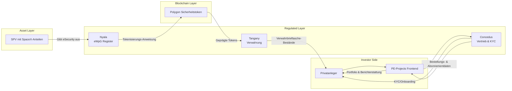
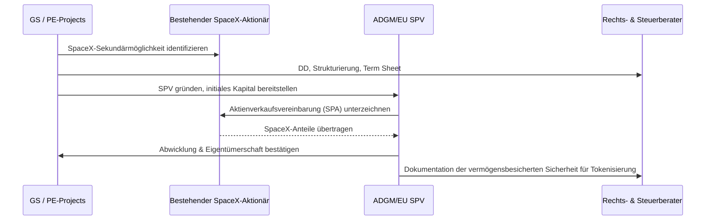
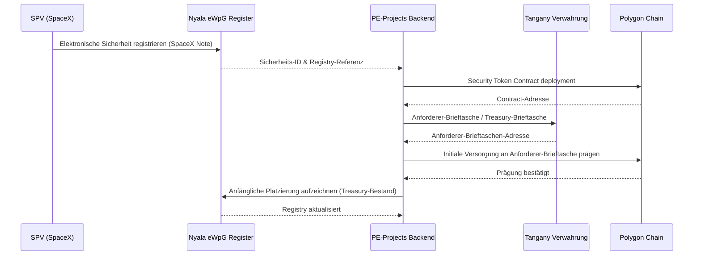
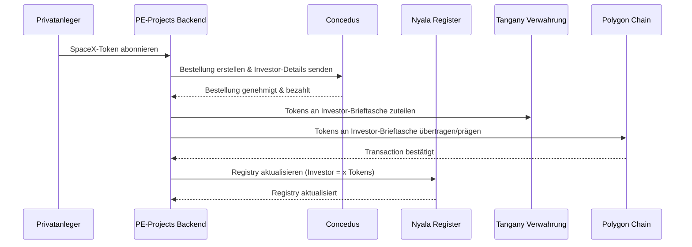
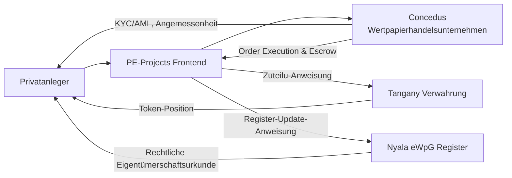
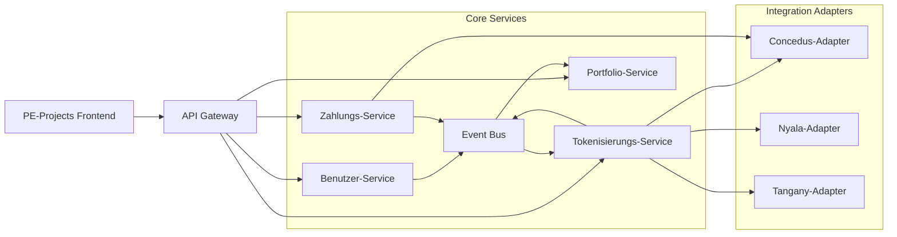
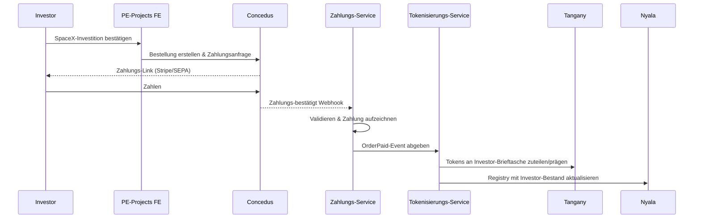
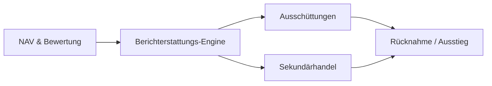

# Tokenisierte Private-Equity-Verteilung über PE-Projects (Beispiel: SpaceX)

## 1. Globale Zusammenfassung der Geschäftsführung

### 1.1 Zweck
Dieses Dokument definiert ein vollständiges End-to-End-Konzept für das Angebot von tokenisierten Private-Equity-(PE)-Vermögenswerten (z. B. SpaceX-Anteile) an Privatanleger über das **PE-Projects**-Ökosystem. Es ist konzipiert für:
- Geschäfts- und Produktverantwortliche
- Technologie- und Engineering-Teams (GS)
- Regulierte Partner (Concedus, Nyala, Tangany)
- Regulatoren und Rechts-/Compliance-Stakeholder (BaFin, ESMA, ADGM)

Das Ziel besteht darin, **traditionelle Private-Equity-Exposition** mit **Blockchain-basierter Tokenisierung** zu kombinieren und gleichzeitig **vollständige regulatorische Ausrichtung** und operative Robustheit zu gewährleisten.

### 1.2 Konzept auf einen Blick
- **SPV** (z. B. ADGM-SPV) hält die zugrunde liegenden PE-Anteile in SpaceX.
- **Nyala** betreibt das **eWpG-konforme elektronische Wertpapierregister** und gibt die elektronische Sicherheit aus.
- **Tangany** bietet **BaFin-regulierte Kryptoverwahrung** der Token für Privatanleger.
- **Polygon** dient als **Blockchain-Ausführungsebene** für das Sicherheitstoken.
- **Concedus** fungiert als **regulierter Distributor (WpHG-Wertpapierhandelsunternehmen)** und bietet **KYC/AML-Onboarding**.
- **PE-Projects** bietet die **Einzelhandels-UI/UX** (Frontend), Orchestrierungs-Backend und Geschäftslogik.

Privatanleger erhalten SpaceX-Exposition über PE-Projects, investieren über einen regulierten Concedus-Flow und erhalten **Sicherheitstokens**, die in **Tangany-Verwahrung** gehalten werden, im **Nyala-eWpG-Register** aufgezeichnet und auf **Polygon** ausgeführt werden.

### 1.3 Schlüsselvorteile
- **Zugang:** Privatanleger erhalten fraktionierte Exposition gegenüber Late-Stage-PE-Vermögenswerten (z. B. SpaceX).
- **Compliance:** Ausrichtung mit **eWpG**, **WpHG**, **MiCAR**, **PRIIPs** und **AML/KYC** über regulierte Partner.
- **Betriebliche Effizienz:** Automatisierte Token-Ausgabe, -Zuteilung und Lebenszyklusverwaltung über Microservice-Architektur.
- **Skalierbarkeit:** Multi-Asset-, Multi-Jurisdiktions-Architektur, die für ein Portfolio von PE-Projekten geeignet ist.

### 1.4 Hauptkomponenten (High-Level)
- **Geschäft & Produkt:** PE-Projects als Marktplatz für tokenisierte PE.
- **Vermögenserwerbung:** SPVs, die zugrunde liegende PE-Anteile erwerben und halten (Beispiel: SpaceX-Sekundäranteil).
- **Tokenisierung:** Nyala-eWpG-Register + Polygon-Token-Verträge + Tangany-Verwahrung.
- **Regulierte Verteilung:** Concedus als WpHG-Wertpapierhandelsunternehmen einschließlich KYC/AML und Kundeneinstufung.
- **Systemarchitektur:** API-gesteuerte Microservices (Benutzer, Wallet, Tokenisierung, Zahlung, KYC, Registry, Verwahrung).
- **Risiko & Compliance:** Klare Zuordnung von Verantwortlichkeiten und Kontrollen.

---

## 2. Abschnitt A — Geschäftsübersicht

### A.1 Zusammenfassung der Geschäftsführung
Das PE-Projects-Ökosystem bietet **tokenisierte Private-Equity-Produkte** an Privatanleger an, indem es mit regulierten Marktteilnehmern zusammenarbeitet. PE-Projects konzentriert sich auf **Produktgestaltung, UX und Orchestrierung**, während Concedus, Nyala, Tangany und Polygon Vertrieb, Registry, Verwahrung und Blockchain-Ausführung abdecken.

### A.2 Nicht-technische Erklärung
- PE-Projects beschafft Private-Equity-Deals (z. B. SpaceX-Sekundäranteile) und hält sie in einer dedizierten SPV.
- Diese SPV gibt eine **elektronische Sicherheit** aus, die Anspruchsrechte auf die zugrunde liegende PE-Position darstellt.
- Die elektronische Sicherheit wird **auf Polygon tokenisiert** und in einem **deutschen eWpG-konformen Register** aufgezeichnet, das von Nyala betrieben wird.
- Die Token werden **in einer regulierten Verwahrlösung** (Tangany) für jeden Anleger geschützt.
- Privatanleger greifen auf diese Produkte über die **PE-Projects-Plattform** zu, während die **regulierte Verteilung** und KYC über Concedus erfolgen.

### A.3 Technische Erklärung
- **Domain-Modell:**
  - `Vermögenswert` = zugrunde liegende SpaceX-Position, die von `SPV` gehalten wird.
  - `Sicherheit` = eWpG-elektronische Sicherheit; Off-Chain im Nyala-Registry und On-Chain als Sicherheitstoken auf Polygon dargestellt.
  - `Investor` = Privatkundin, die über Concedus onboarded wurde; mit `Tangany-Verwahrbrieftasche` verknüpft.
  - `Bestellung` = Anlage-Anweisung vom Investor; ausgeführt durch Concedus-Bestellablauf.
  - `TokenAllocation` = Zuordnung von On-Chain-Tokens & Registry-Einträgen zum Investor.

- **Systeminteraktionen:**
  - PE-Projects-Backend orchestriert Aufrufe für:
    - Concedus-API (KYC, Eignung, Bestellrouting).
    - Nyala-API (Register-Erstellung/Update, Ausgabe, Kapitalmaßnahmen).
    - Tangany-API (Brieftasche-Erstellung, On-/Off-Chain-Transfer, Whitelist).
    - Polygon-Smart-Contracts (Token-Prägung, Transfers, Compliance-Überprüfungen).

### A.4 Mermaid-Diagramm — High-Level-Geschäftsprozess

**Technische Anmerkung:** Das Diagramm abstrahiert Microservices; detaillierte architektonische Ansichten folgen in Abschnitt F.

---

## 3. Abschnitt B — Vermögenserwerbungsfluss (Beispiel: SpaceX)

### B.1 Zusammenfassung der Geschäftsführung
Dieser Abschnitt beschreibt, wie der zugrunde liegende PE-Anteil (z. B. SpaceX) in eine SPV-Struktur erworben wird, die **rechtlich sauber**, **steuereffizient** und **tokenisierungsbereit** ist.

### B.2 Schritt-für-Schritt-Kauffluss (SpaceX-Beispiel)
1. **Deal-Beschaffung & Due Diligence (DD)**
   - PE-Projects (oder GS/GS Fintech) beschafft eine Sekundärtransaktion zum Erwerb von SpaceX-Anteilen von einem bestehenden Aktionär.
   - Rechtliche, finanzielle und technische Due Diligence wird durchgeführt.

2. **SPV-Setup**
   - Gründung einer **ADGM-SPV** (Abu Dhabi Global Market) oder EU-SPV (z. B. Luxemburg oder Irland) zum Halten der SpaceX-Anteile.
   - Die SPV ist vollständig Eigentum einer Holdinggesellschaft (GS Fintech oder eines PE-Projects-Gruppenunternehmens), abhängig von Steuer- und Regulierungsplanung.

3. **Kaufvertrag**
   - Die SPV unterzeichnet eine **Aktienverkaufsvereinbarung (SPA)** mit dem verkaufenden Aktionär.
   - Die SPA definiert Kaufpreis, Bedingungen, Abschluss und Beschränkungen.

4. **SPV-Finanzierung**
   - GS Fintech oder PE-Projects organisiert anfängliche Finanzierung (Überbrückungsfinanzierung) für die SPV.
   - Später werden Privatanleger-Gelder (über Token-Ausgabe) die SPV refinanzieren.

5. **Abschluss & Abwicklung**
   - Die zugrunde liegenden SpaceX-Anteile werden an die SPV übertragen (vorbehaltlich Ausstellergenehmigungen/Vorkaufsrecht, falls zutreffend).
   - Das endgültige Eigentum wird in der Emittenten-Oberflächentabelle oder durch eine Nominee-Vereinbarung aufgezeichnet.

6. **Wirtschaftliche Verbindung zu Token-Inhabern**
   - Die SPV gibt eine **elektronische Note/Sicherheit** aus, deren Cashflows durch SpaceX-Anteile gedeckt sind (Dividenden, Exit-Erträge).
   - Diese Sicherheit wird tokenisiert und über PE-Projects an Investor angeboten.

### B.3 Erforderliche Einrichtungen (ADGM / EU)

| Einrichtung | Jurisdiktion | Rolle |
|-------------|--------------|-------|
| GS Fintech / GS Holdings | EU (z. B. Deutschland/Lux) | Technologie- und Strukturierungsplattform, IP-Eigentümer, Verträge mit Partnern |
| SPV 1 (SpaceX) | ADGM oder EU | Hält SpaceX-Anteile, gibt vermögensbesicherte Sicherheit aus |
| PE-Projects Plattformeinrichtung | EU | Betreibt Front-End, Marketing, Produktmanagement (unter MiCAR/WpHG-Marketingregeln) |
| Concedus | Deutschland | Lizenzierter Distributor & Wertpapierhandelsunternehmen unter WpHG |
| Nyala | Deutschland | Betreiber des Krypto-Wertpapierregisters unter eWpG |
| Tangany | Deutschland | Von der BaFin lizenzierter Krypto-Verwahrer |

### B.4 Rechts- + Steuerliche Überlegungen (High-Level)
- **Rechtlich:**
  - Gewährleisten, dass das SPV-Instrument als **elektronische Sicherheit** unter eWpG (falls deutsches Recht gewählt) oder gleichwertiges unter anderem EU-Recht qualifiziert ist.
  - Corporate Governance: Aktionärsvereinbarungen, Wasserfälle und Exit-Verteilungen müssen in der SPV-Dokumentation widergespiegelt werden.
  - Investor-Rechte: klar in Token-Bedingungen und -Konditionen definiert (Prospekt/Wertpapierinformationen/KID).

- **Steuer:**
  - Bevorzugen Sie eine **steuerlich neutrale SPV**, um unbeabsichtigte Quellensteuer oder Unternehmensteuer-Belastung der Ausschüttungen zu vermeiden.
  - Richten Sie die Exit-Besteuerung für Privatanleger mit lokaler Steuerberatung aus (Kapitalgewinne vs. Einkommen).

### B.5 Mermaid-Diagramm — Vermögenserwerbungsfluss

---

## 4. Abschnitt C — Tokenisierungsarchitektur

### C.1 Zusammenfassung der Geschäftsführung
Der Tokenisierungs-Stack verbindet die **SPV-elektronische Sicherheit** mit **On-Chain-Sicherheits-Tokens**, die sicher verwahrt und in einem konformen Register aufgezeichnet werden. Nyala, Tangany und Polygon bilden die Kerninfrastruktur, während PE-Projects die Flows orchestriert.

### C.2 Rolle von Nyala (eWpG-Register)
- Betreibt das **Krypto-Wertpapierregister** unter eWpG.
- Verwaltet die **rechtliche Eigentümerschaftsurkunde** für die elektronische Sicherheit.
- Schnittstellen mit dem PE-Projects-Backend für:
  - Anfängliche Registrierung der SpaceX-gebundenen Sicherheit.
  - Aufzeichnung der primären Platzierung bei Investoren.
  - Aufzeichnung nachfolgender Transfers (Sekundärhandel, Rücknahmen, Kapitalmaßnahmen).

### C.3 Rolle von Tangany (Verwahrung)
- Bietet **von der BaFin regulierte Kryptoverwahrung** für Sicherheitstokens.
- Verwaltet segregierte **Verwahrbrieftaschen** pro Investor.
- Gewährleistet **Sicherheitsaufbewahrung** und **Schlüsselverwaltung** mit institutioneller Sicherheit.
- Legt APIs offen für:
  - Brieftasche-Erstellung.
  - Token-Empfang/Prägung.
  - Verarbeitung von Transfers unterliegen Whitelist/Berechtigung.

### C.4 Rolle von Polygon (Blockchain)
- Öffentliche, EVM-kompatible Blockchain für Token-Verträge.
- Hohe Durchsatzleistung, niedrige Gas-Kosten, ausgefeilte Tools.
- Smart-Contract-Framework für **konforme Sicherheitstokens** (z. B. ERC-3643/ERC-1400-ähnliche Muster).

### C.5 Token-Standards (ERC-3643, ERC-1400)

- **ERC-3643 (T-REX / genehmigte Tokens)**
  - On-Chain-Durchsetzung der Investor-Berechtigung über Off-Chain-Identitäts-Registry.
  - Whitelisting/Blacklisting von Adressen.
  - Gutes Passendes für regulierte Sicherheitstokens.

- **ERC-1400 (Wertpapier-Token-Standard)**
  - Aufgeteilte Guthaben, Transfer-Beschränkungen und reichhaltige Compliance-Funktionen.
  - Unterstützt Kapitalmaßnahmen (Rücknahmen, erzwungene Transfers).

**Implementierungsempfehlung:**
- Verwenden Sie eine **ERC-3643-inspirierte Implementierung** (genehmigte Transfers) mit **ERC-1400-ähnlicher Aufteilu** für:
  - Primärplatzierung vs. Sekundärmarktaufteilu.
  - Lock-up-Tranchen bei Bedarf.

### C.6 Mermaid-Diagramm — Token-Ausgabetfluss (SPV → Nyala → Tangany → Polygon)

### C.7 Mermaid-Diagramm — Register-Aktualisierung & Zuteilung

---

## 5. Abschnitt D — Regulierungsstrategie

### D.1 Zusammenfassung der Geschäftsführung
Die Regulierungsstrategie nutzt **lizenzierte Partner**, um eine robuste, BaFin-konforme Verteilung von tokenisierten Wertpapieren an Privatanleger zu gewährleisten.

### D.2 Concedus-Verantwortlichkeiten
- Fungiert als **Wertpapierhandelsunternehmen unter WpHG** (z. B. Investment-Makler/Platzierung).
- Führt **Kundisches Onboarding, KYC/AML, Angemessenheit/Eignung-Prüfungen** durch.
- Führt Abonnements aus und hält Investor-Gelder in **Escrow**, falls erforderlich.
- Stellt alle erforderlichen **MiFID-II / WpHG-Offenlegungen** bereit (Kosten, Risiken, Zielmarkt).

### D.3 WpHG-Regeln (Deutschland)
- Der Einzelhandel-Vertrieb der tokenisierten SpaceX-Sicherheit muss sich an das **deutsche Wertpapierhandelsgesetz (WpHG)** und MiFID II halten.
- Schlüsselaspekte:
  - **Kundeneinstufung**: Privatanleger vs. professionell.
  - **Angemessenheit/Eignung** für komplexe Produkte.
  - **Best Execution / Order Handling** über Concedus.
  - **Offenlegung & Dokumentation**: Ex-Ante- und Ex-Post-Kosteninformationen, Risiko-Offenlegungen.

### D.4 eWpG-Regeln
- Die zugrunde liegende Sicherheit ist eine **elektronische Sicherheit** unter eWpG, aufgezeichnet in einem **Krypto-Wertpapierregister**, das von Nyala betrieben wird.
- Anforderungen:
  - Ordnungsgemäße Identifikation des Emittenten und der Sicherheit.
  - Unveränderliches, nachprüfbares kryptografisches Register.
  - Klare rechtliche Gleichwertigkeit zu traditionellen beglaubigten Wertpapieren.

### D.5 MiCAR-Überlegungen
- Beurteilen Sie, ob der SpaceX-gebundene Token als **MiCAR-"Krypto-Vermögenswert"** qualifiziert oder stattdessen eine **eWpG-elektronische Sicherheit** ist (und daher außerhalb des MiCAR-Kern, aber unterliegt den Kapitalmarktregeln).
- Halten Sie Marketing und grenzüberschreitende Vertrieb in Einklang mit MiCAR/ESMA-Leitlinien.

### D.6 PRIIPs / KID
- Für Privatanleger in der EU ist **PRIIPs-Verordnung** erforderlich, ein **Schlüsselinformationsdokument (KID)**.
- KID fasst zusammen:
  - Produktnatur (SpaceX-gebundenes Sicherheitstoken).
  - Risiko- und Ertragsprofil.
  - Kosten und Gebühren.
  - Empfohlener Haltezeitraum.

### D.7 AML / KYC-Pflichten
- Verantwortlichkeit hauptsächlich bei **Concedus** als reguliertes Wertpapierhandelsunternehmen.
- PE-Projects darf AML-Regeln nicht umgehen; Daten-Freigabe & Protokolle müssen **auditable** sein.

### D.8 Mermaid-Diagramm — Regulierter Vertriebsfluss

---

## 6. Abschnitt E — Investor-Benutzer-Reise

### E.1 Zusammenfassung der Geschäftsführung
Das Investor-Erlebnis ist **Einzelnes Front-End** (PE-Projects), während regulatorische und technische Prozesse im Hintergrund ablaufen. Von der Landingpage bis zur Portfolio-Ansicht werden alle Flows durch reibungslose API-Aufrufe orchestriert.

### E.2 Schritt-für-Schritt-Benutzer-Reise
1. **Landingpage**
   - Investor entdeckt PE-Projects SpaceX-Angebot.
   - Sieht Informationen auf hoher Ebene, Risikowarnung und Call-to-Action ("In SpaceX-Exposition investieren").

2. **Kontoerstellung**
   - E-Mail + Passwort oder SSO.
   - Grundlegende Profilinformationen.

3. **KYC & Investor-Profil (über Concedus)**
   - Umleitung oder eingebettetes Widget für KYC.
   - ID-Verifizierung, Geldquelle, Finanzwissen-Fragebogen.
   - Einstufung als Privatanleger/professionell.

4. **Produktansicht (SpaceX-Token)**
   - Detaillierte Produktseite:
     - Beschreibung der zugrunde liegenden SpaceX-Exposition.
     - Risikozusammenfassung.
     - Erwarteter Haltzeitraum, Illiquidität.
     - KID-Download.

5. **Investment-Konfiguration**
   - Investor wählt Anlage-Betrag (in EUR) im Min/Max-Bereich.
   - Echtzeit-Berechnung der erwarteten Token-Menge.

6. **Bestellausführung (Concedus)**
   - Investor bestätigt Bestellung.
   - Concedus verarbeitet Bestellung, stellt Zahlungsanweisungen bereit (z. B. Stripe/SEPA).
   - Nach Zahlungsbestätigung wird Bestellung als "bezahlt" markiert.

7. **Brieftasche & Token-Zuteilung (Tangany)**
   - PE-Projects löst Erstellung einer **Tangany-Verwahrbrieftasche** aus, falls nicht vorhanden.
   - Nach Zahlungsbestätigung löst das Backend Token-Zuteilung aus.

8. **Registry-Update (Nyala)**
   - Nach On-Chain-Zuteilung ruft das Backend Nyala auf, um die Investor-Bestandshaltung aufzuzeichnen.

9. **Portfolio-Ansicht**
   - Investor sieht SpaceX-Token-Position, Menge und indikativen Wert.

### E.3 Bildschirm/Fluss-Beschreibung (Nicht-Technisch)
- **Bildschirme:**
  - Home / Landingpage (SpaceX-Highlight).
  - Produktdetails (SpaceX-Anlage-These, Struktur, KID-Link).
  - Onboarding + KYC-Assistent.
  - Anlage-Betrag / Bestellung-Bestätigung.
  - Zahlungsstatus-Seite.
  - Portfolio-Dashboard.

### E.4 Mermaid-Diagramm — Vollständiger Benutzer-Fluss

```mermaid
flowchart LR
    LP[Landingpage]
    REG[Registrierung / Anmeldung]
    KYC[KYC & Investor-Profil Profiierung Concedus]
    PROD[SpaceX Produktseite]
    CONF[Investment-Konfiguration]
    PAY[Zahlung Stripe/SEPA über Concedus]
    WAL[Brieftasche-Erstellung Tangany]
    ALLOC[Token-Zuteilung]
    REGUPD[Nyala Registry-Update]
    PORT[Portfolio-Dashboard]

    LP --> REG
    REG --> KYC
    KYC --> PROD
    PROD --> CONF
    CONF --> PAY
    PAY --> WAL
    WAL --> ALLOC
    ALLOC --> REGUPD
    REGUPD --> PORT
```

---

## 7. Abschnitt F — Backend-Systemarchitektur

### F.1 Zusammenfassung der Geschäftsführung
Die Backend-Architektur ist **Microservice-basiert** mit klarer Trennung zwischen Benutzerverwaltung, Tokenisierung, Zahlungen und Integrationen mit externen Partnern.

### F.2 Microservices-Übersicht

| Service | Verantwortlichkeit |
|---------|-------------------|
| **API Gateway** | Einstiegspunkt für Frontend, Routing & Authentifizierung |
| **Benutzer-Service** | Benutzer-Profile, Investor-Einstufungs-Cache |
| **KYC/Concedus-Adapter** | Integriert mit Concedus-APIs für KYC & Bestellungen |
| **Tokenisierungs-Service** | Verwaltet Wertpapiere, Token-Verträge und Zuteilu |
| **Nyala-Adapter** | Verbindung zu Nyala eWpG Register-APIs |
| **Tangany-Adapter** | Brieftasche-Erstellung, Token-Transfers, Guthaben |
| **Zahlungs-Service** | Zahlungs-Orchestrierung, Stripe/SEPA-Callbacks, Abstimmu |
| **Portfolio-Service** | Aggregiert Positionen aus Nyala/Tangany für UI |
| **Event Bus** | Kafka/RabbitMQ für asynchrone Verarbeitung (Bestellungen, Abwicklung) |
| **Monitoring & Logging** | Zentrale Protokolle, Metriken, Benachrichtigun |

### F.3 Erforderliche APIs (Beispiele)
- **Concedus-API:**
  - `/kyc/start`, `/kyc/status`.
  - `/orders/create`, `/orders/status`, `/payments/notify`.

- **Nyala-API:**
  - `/securities/register`.
  - `/holdings/update`.
  - `/corporate-actions/*`.

- **Tangany-API:**
  - `/wallets/create`.
  - `/tokens/mint`, `/tokens/transfer`.
  - `/balances/{wallet}`.

### F.4 Datenbank-Logik (Konzeptionell)
- **Core DB (PostgreSQL)**
  - `users`, `investor_profiles`, `kyc_status`.
  - `products` (z. B. SpaceX), `offers`, `orders`.
  - `allocations`, `transactions`, `wallets` (Zuordnung zu Tangany IDs).

- **Referenzdaten**
  - `jurisdictions`, `risk_categories`, `kyc_providers`.

### F.5 Event Queues / Abwicklungs-Logik
- **Events:**
  - `OrderPaid` → triggert Zuteilu-Workflow.
  - `TokensAllocated` → triggert Nyala Registry-Update.
  - `CorporateActionEvent` → triggert Verteilungs-/Benachrichtigung.

### F.6 Mermaid-Diagramm — Backend-Architektur

---

## 8. Abschnitt G — Zahlung & Abwicklung

### G.1 Zusammenfassung der Geschäftsführung
Zahlungen werden von **Concedus (Escrow)** und externen PSPs (z. B. Stripe, SEPA) verarbeitet. Token-Zuteilung wird **nur nach bestätigter Abwicklung** ausgelöst, und die Abstimmung gewährleistet Konsistenz zwischen **Bargeld**, **Tokens** und **Registry**.

### G.2 Zahlungsfluss (Stripe / Banküberweisung / Concedus Escrow)
1. Investor bestätigt Bestellung.
2. Concedus generiert Zahlungsanweisung und führt Benutzer zur Stripe-Kartenzahlung oder Banküberweisung.
3. Bei erfolgreicher Zahlung benachrichtigt Concedus PE-Projects über Callback/Webhook.
4. Zahlungs-Service validiert und erstellt ein `OrderPaid`-Event.

### G.3 Token-Zuteilu-Regeln
- Zuteilung ist **pro-rata basierend auf bezahltem Betrag** und Token-Preis.
- Rounding wird zentral verarbeitet; jeder Bruchteil-Rest bleibt möglicherweise als Bargeld unzugeteilt.
- Hard Cap bei gesamter Ausgabegröße für jedes SpaceX-Angebot.

### G.4 Abstimmu-Logik
- Tägliche/Echtzeit-Abstimmung zwischen:
  - Concedus-Zahlungsaufzeichnungen.
  - PE-Projects Orders DB.
  - Tangany Token-Guthaben.
  - Nyala Registry-Einträge.

### G.5 Mermaid-Diagramm — Zahlung & Abwicklungsfluss

---

## 9. Abschnitt H — Post-Trade-Lebenszyklu

### H.1 Zusammenfassung der Geschäftsführung
Nach der Ausgabe muss PE-Projects **NAV-Updates, Berichterstattung, Ausschüttungen, Kapitalmaßnahmen und Sekundärhandel** auf kontrollierte und transparente Weise verwalten.

### H.2 NAV-Updates
- NAV für die SpaceX-Position wird aktualisiert:
  - Basierend auf periodischen Bewertungsberichten (z. B. von externen Bewertungsanbietern).
  - In der Plattform-UI nur als indikativer Wert widergespiegelt.

### H.3 Berichterstattung
- Investor-ebenen-Berichterstattung:
  - Portfolio-Statements.
  - Steuer-Statements (falls machbar).
  - Regulatorische Konten-Statements (über Concedus, falls erforderlich).

### H.4 Coupon-Handhabung / Ausschüttungen
- Wenn SpaceX Dividenden zahlt oder es ein Liquiditätsereignis gibt:
  - SPV erhält Bargeld.
  - Nach Gebühren und Ausgaben wird das Netto-Bargeld pro-rata an Token-Inhaber verteilt.
  - Verteilungsfluss über Concedus oder Zahlungsstelle; Investor erhalten Banküberweisung.

### H.5 Sekundärhandel
- Anfangs, **eingeschränkte oder Bulletin-Board-ähnliche** Transfers:
  - Transfers nur zwischen berechtigten, KYC'd Investor erlaubt.
  - On-Chain-Transfer-Überprüfungen über ERC-3643 (nur whitelistete Adressen).
- Längerfristig:
  - Integration mit einem regulierten **MTF/OTF** oder Bulletin-Board für Sekundär-Liquidität.

### H.6 Rücknahme
- Bei Fälligkeit oder beim Ausstieg aus der SpaceX-Position:
  - SPV verkauft zugrunde liegende Anteile.
  - Erlöse werden pro-rata an Token-Inhaber verteilt.
  - Tokens werden verbrannt und Registry wird entsprechend aktualisiert.

### H.7 Mermaid-Diagramm — Post-Trade-Lebenszyklu

---

## 10. Abschnitt I — Erforderliche Corporate-Struktur

### I.1 Zusammenfassung der Geschäftsführung
Eine Multi-Entitäts-Struktur trennt **Technologie**, **Vermögenshaltung** und **regulierte Vertrieb**-Verantwortlichkeiten.

### I.2 GS Fintech Entität
- Besitzt den PE-Projects-Technologie-Stack & IP.
- Verträge mit Partnern: Concedus, Nyala, Tangany, PSPs.
- Stellt White-Label-APIs und Plattform zur Verfügung.

### I.3 ADGM SPV
- Hält SpaceX-Anteile.
- Gibt die vermögensbesicherte, über Nyala/Tangany/Polygon tokenisierte Sicherheit aus.

### I.4 EU-Vertriebsstruktur
- PE-Projects EU-Entität verantwortlich für:
  - Marketing & Kundenverhältnis-Management.
  - Produktdokumentations-Koordination (Prospekt/KID).

### I.5 Verträge zwischen Entitäten (Beispiele)
- **GS ↔ Concedus:**
  - Vertriebsrahmen-Vereinbarung.
  - Daten-Freigabe & Outsourcing-Vereinbarungen.

- **GS ↔ Nyala:**
  - Register-Betreiber-Vertrag.

- **GS ↔ Tangany:**
  - Verwahrungsservices-Vereinbarung.

- **GS ↔ SPV:**
  - Plattform- & Verwaltungs-Vereinbarung.

### I.6 Lizenzierungs-Abhängigkeiten
- Concedus: WpHG / MiFID Wertpapierhandelsunternehmen-Lizenz.
- Nyala: eWpG Krypto-Wertpapierregister-Lizenz.
- Tangany: BaFin Krypto-Verwahrungs-Lizenz.
- GS/PE-Projects: Mögliche MiCAR / Prospekt-Regime-Verpflichtungen abhängig von Struktur.

### I.7 Mitarbeiter & Operativ-Einheiten
- **Produkt & Strukturierung** (PE/Kapitalmarkt-Spezialisten).
- **Rechts & Compliance**.
- **Technik & DevOps**.
- **Risiko & Berichterstattung**.
- **Investor-Beziehungen & Support**.

---

## 11. Abschnitt J — Risiko & Compliance-Matrix

### J.1 Zusammenfassung der Geschäftsführung
Tokenisierte PE-Produkte tragen **Markt-**, **Liquiditäts-**, **Operationale-**, **Regulierungs-** und **Technologie**-Risiken. Eine strukturierte Matrix ordnet Mitigationen und verantwortliche Eigner zu.

### J.2 Schlüsselrisiken & Mitigationen (Beispiel)

| Risikokategorie | Beschreibung | Mitigation | Eigner |
|-----------------|-------------|-----------|--------|
| Markt-Risiko | SpaceX-Bewertung fällt oder Ausstieg verzögert sich | Klare Risiko-Offenlegungen, keine Kapitalgarantie | Produkt & Rechtlich |
| Liquiditäts-Risiko | Begrenzte Sekundär-Markt | Kommunikation des Langfrist-Haltzeitraums, mögliche MTF-Integration | Produkt |
| Regulierungs-Risiko | Änderungen in eWpG/MiCAR-Interpretation | Laufende rechtliche Überwachung, BaFin-Dialog | Rechtlich & Compliance |
| Operationalen-Risiko | Integrations-Ausfälle (APIs) | Redundante Überwachung, Fallbacks, manuelle Verfahren | Technik & Ops |
| Verwahrungs-/Sicherheits-Risiko | Brieftasche-Kompromittierung | Tangany-Verwahrung verwenden, Sicherheits-Audits, starke Zugriffskontrolle | Technik & Tangany |
| Datenschutz-Risiko | Personendaten-Breaches | GDPR-konforme Datenbehandlung, Verschlüsselung, DPO | Rechtlich & IT-Sicherheit |

---

## 12. Abschnitt K — Finale Einheitliche Zusammenfassung

Das PE-Projects-Ökosystem ermöglicht Privatanleger den Zugang zu Late-Stage-Private-Equity-Möglichkeiten wie SpaceX über eine **regulierte, tokenisierte Struktur**. Durch die Kombination von:
- **SPVs** für Vermögenshaltung,
- **Nyala** als eWpG-konforme Krypto-Wertpapier-Registry,
- **Tangany** als BaFin-lizenzierter Krypto-Verwahrer,
- **Polygon** als Ausführungsebene,
- **Concedus** als WpHG-Wertpapierhandelsunternehmen und KYC/Vertriebspartner,
- **GS/PE-Projects** als Technologie- und Produkt-Orchestrator,

…liefert das Modell einen institutionell glaubwürdigen, regulatorisch freundlichen und technisch robusten Kanal, um Private Equity an eine breitere Investor-Basis zu bringen.

Dieses Dokument bietet sowohl **nicht-technische** als auch **technische** Ansichten, Benutzer-Reisen, Architektur-Diagramme und regulatorische Rahmens, um als **Blueprint** für Implementierung und Diskussionen mit Partnern und Supervisoren zu dienen.
