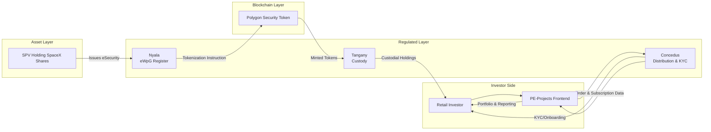
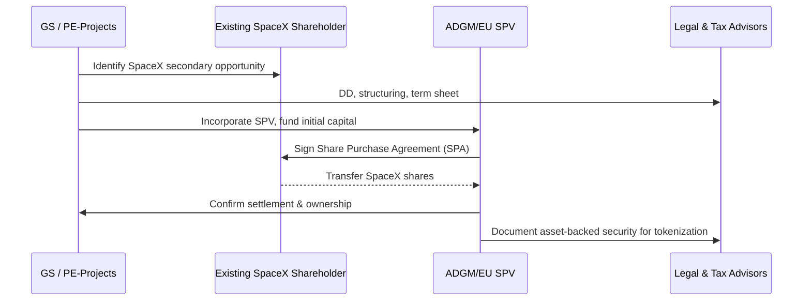
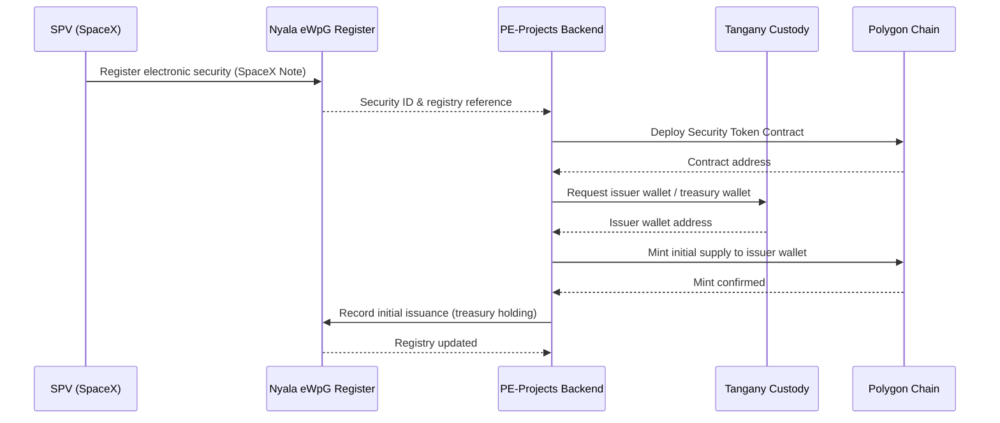
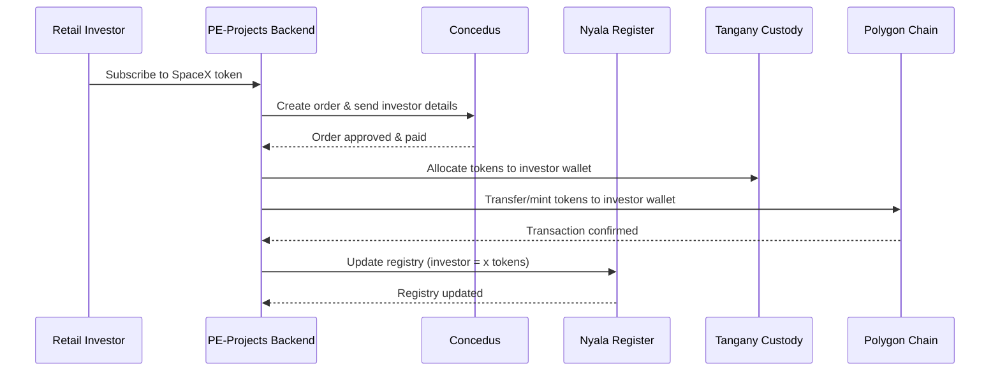
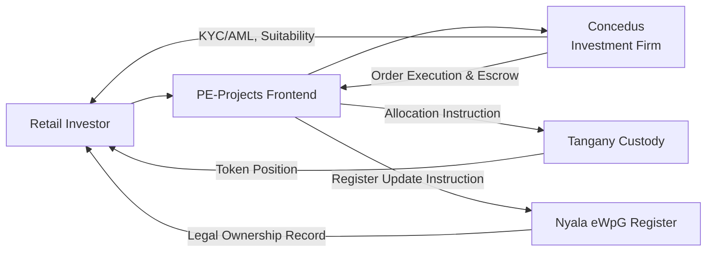
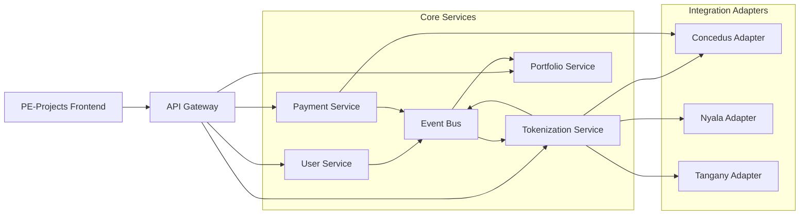
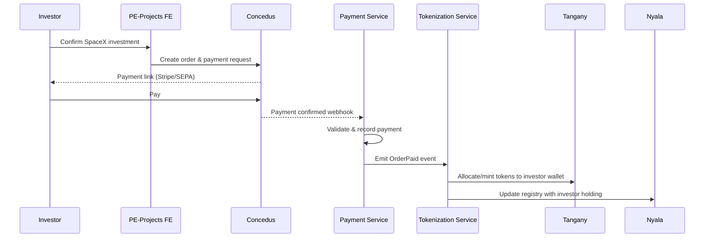
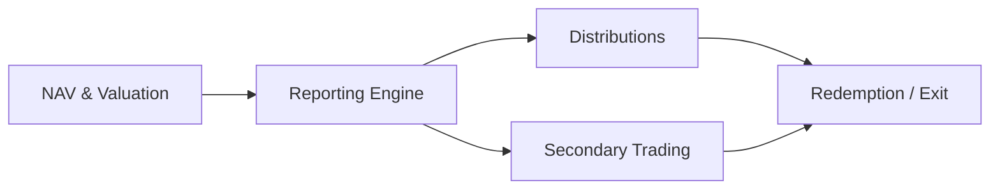

# Tokenized Private Equity Distribution via PE-Projects (Example: SpaceX)

## 1. Global Executive Summary

### 1.1 Purpose
This document defines a complete end-to-end concept for offering tokenized Private Equity (PE) assets (e.g., SpaceX shares) to retail investors through the **PE-Projects** ecosystem. It is designed for:
- Product & business stakeholders
- Technology and engineering teams (GS)
- Regulated partners (Concedus, Nyala, Tangany)
- Regulators and legal/compliance stakeholders (BaFin, ESMA, ADGM)

The goal is to combine **traditional private equity exposure** with **blockchain-based tokenization**, while ensuring **full regulatory alignment** and operational robustness.

### 1.2 Concept in One View
- **SPV** (e.g., ADGM SPV) holds the underlying PE shares in SpaceX.
- **Nyala** operates the **eWpG-compliant electronic securities register** and issues the electronic security.
- **Tangany** provides **BaFin-regulated crypto custody** of the tokens for retail investors.
- **Polygon** serves as the **blockchain execution layer** for the security token.
- **Concedus** acts as **regulated distributor (WpHG investment firm)** and provides **KYC/AML onboarding**.
- **PE-Projects** provides the **retail UI/UX** (frontend), orchestration backend, and business logic.

Retail investors access SpaceX exposure through PE-Projects, invest via a regulated Concedus flow, and receive **security tokens** held in **Tangany custody**, recorded in a **Nyala eWpG register** and executed on **Polygon**.

### 1.3 Key Benefits
- **Access:** Retail investors gain fractional exposure to late-stage PE assets (e.g., SpaceX).
- **Compliance:** Alignment with **eWpG**, **WpHG**, **MiCAR**, **PRIIPs**, and **AML/KYC** via regulated partners.
- **Operational Efficiency:** Automated token issuance, allocation, and lifecycle management via microservice architecture.
- **Scalability:** Multi-asset, multi-jurisdiction architecture suitable for a portfolio of PE projects.

### 1.4 Major Components (High-Level)
- **Business & Product:** PE-Projects as a marketplace for tokenized PE.
- **Asset Acquisition:** SPVs acquiring and holding underlying PE stakes (example: SpaceX secondary stake).
- **Tokenization:** Nyala eWpG register + Polygon token contracts + Tangany custody.
- **Regulated Distribution:** Concedus as WpHG investment firm including KYC/AML and client classification.
- **System Architecture:** API-driven microservices (User, Wallet, Tokenization, Payment, KYC, Registry, Custody).
- **Risk & Compliance:** Clear allocation of responsibilities and controls.

---

## 2. Section A — Business Overview

### A.1 Executive Summary
The PE-Projects ecosystem offers **tokenized private equity products** to retail investors by partnering with regulated market participants. PE-Projects focuses on **product design, UX, and orchestration**, while Concedus, Nyala, Tangany, and Polygon cover distribution, registry, custody, and blockchain execution.

### A.2 Non-Technical Explanation
- PE-Projects sources private equity deals (e.g., SpaceX secondary shares) and holds them in a dedicated SPV.
- This SPV issues an **electronic security** that represents claim rights on the underlying PE position.
- The electronic security is **tokenized on Polygon** and recorded in a **German eWpG-compliant register** operated by Nyala.
- The tokens are **safeguarded in a regulated custody solution** (Tangany) for each investor.
- Retail investors access these products via the **PE-Projects platform**, while the **regulated distribution** and KYC are handled via Concedus.

### A.3 Technical Explanation
- **Domain Model:**
  - `Asset` = underlying SpaceX stake held by `SPV`.
  - `Security` = eWpG electronic security; represented off-chain in Nyala registry and on-chain as a security token on Polygon.
  - `Investor` = retail client onboarded via Concedus; linked to a `Tangany custodial wallet`.
  - `Order` = investment instruction from investor; executed through Concedus order flow.
  - `TokenAllocation` = mapping of on-chain tokens & registry entries to investor.

- **Systems Interactions:**
  - PE-Projects Backend orchestrates calls to:
    - Concedus API (KYC, suitability, order routing).
    - Nyala API (register creation/update, issuance, corporate actions).
    - Tangany API (wallet creation, on-/off-chain transfer, whitelisting).
    - Polygon smart contracts (token minting, transfers, compliance checks).

### A.4 Mermaid Diagram — High-Level Business Process

**Technical Note:** The diagram abstracts away microservices; detailed architectural views follow in Section F.

---

## 3. Section B — Asset Acquisition Flow (Example: SpaceX)

### B.1 Executive Summary
This section describes how the underlying PE stake (e.g., SpaceX) is acquired into an SPV structure that is **legally clean**, **tax-efficient**, and **tokenization-ready**.

### B.2 Step-by-Step Purchase Flow (SpaceX Example)
1. **Deal Sourcing & DD**
   - PE-Projects (or GS/GS Fintech) sources a secondary transaction to acquire SpaceX shares from an existing shareholder.
   - Legal, financial, and technical due diligence (DD) is performed.

2. **SPV Setup**
   - Incorporate an **ADGM SPV** (Abu Dhabi Global Market) or EU SPV (e.g., Luxembourg or Ireland) to hold the SpaceX shares.
   - SPV is fully owned by a holding entity (GS Fintech or a PE-Projects group company), depending on tax and regulatory planning.

3. **Purchase Agreement**
   - SPV signs a **Share Purchase Agreement (SPA)** with the selling shareholder.
   - SPA defines purchase price, conditions, closing, restrictions.

4. **Funding the SPV**
   - GS Fintech or PE-Projects arranges initial funding (bridge financing) for the SPV.
   - Later, retail investor funds (via token issuance) will refinance the SPV.

5. **Closing & Settlement**
   - The underlying SpaceX shares are transferred to the SPV (subject to issuer consents/right of first refusal as applicable).
   - Final ownership is recorded in the issuer’s cap table or through a nominee arrangement.

6. **Economic Link to Token Holders**
   - The SPV issues an **electronic note / security** whose cashflows are backed by the SpaceX shares (dividends, exit proceeds).
   - This security will be tokenized and offered to investors via PE-Projects.

### B.3 Required Entities (ADGM / EU)

| Entity | Jurisdiction | Role |
|--------|--------------|------|
| GS Fintech / GS Holdings | EU (e.g., Germany/Lux) | Technology and structuring platform, owner of IP, contracts with partners |
| SPV 1 (SpaceX) | ADGM or EU | Holds SpaceX shares, issues asset-backed security |
| PE-Projects Platform Entity | EU | Operates front-end, marketing, product management (under MiCAR/WpHG marketing rules) |
| Concedus | Germany | Licensed distributor & investment firm under WpHG |
| Nyala | Germany | Crypto securities register operator under eWpG |
| Tangany | Germany | BaFin-licensed crypto custodian |

### B.4 Legal + Tax Considerations (High-Level)
- **Legal:**
  - Ensure the SPV’s instrument qualifies as an **electronic security** under eWpG (if German law chosen) or equivalent under other EU law.
  - Corporate governance: shareholders’ agreements, waterfalls, and exit distributions must be mirrored in SPV documentation.
  - Investor rights: clearly defined in token terms and conditions (prospectus / securities information sheet / KID).

- **Tax:**
  - Prefer a **tax-neutral SPV** to avoid unintended withholding or corporate tax drag on distributions.
  - Align exit taxation treatment for retail investors with local tax advice (capital gains vs. income).

### B.5 Mermaid Diagram — Asset Acquisition Flow

---

## 4. Section C — Tokenization Architecture

### C.1 Executive Summary
The tokenization stack connects the **SPV’s electronic security** to **on-chain security tokens** that are safely custodied and recorded in a compliant register. Nyala, Tangany, and Polygon form the core infrastructure, while PE-Projects orchestrates flows.

### C.2 Role of Nyala (eWpG Register)
- Operates the **crypto securities register** under eWpG.
- Maintains the **legal record of ownership** for the electronic security.
- Interfaces with the PE-Projects backend for:
  - Initial registration of the SpaceX-linked security.
  - Recording primary issuance to investors.
  - Recording subsequent transfers (secondary trades, redemptions, corporate actions).

### C.3 Role of Tangany (Custody)
- Provides **BaFin-regulated crypto custody** for security tokens.
- Maintains segregated **custodial wallets** per investor.
- Ensures **safekeeping** and **key management**, with institutional-grade security.
- Exposes APIs to:
  - Create wallets.
  - Receive/mint tokens.
  - Process transfers subject to whitelist/eligibility.

### C.4 Role of Polygon (Blockchain)
- Public, EVM-compatible blockchain for token contracts.
- High throughput, low gas costs, mature tooling.
- Smart contract framework for **compliant security tokens** (e.g., ERC-3643 / ERC-1400-like patterns).

### C.5 Token Standards (ERC-3643, ERC-1400)

- **ERC-3643 (T-REX / permissioned tokens)**
  - On-chain enforcement of investor eligibility via off-chain identity registry.
  - Whitelisting/blacklisting of addresses.
  - Good fit for regulated security tokens.

- **ERC-1400 (Security Token Standard)**
  - Partitioned balances, transfer restrictions, and rich compliance features.
  - Supports corporate actions (redemptions, forced transfers).

**Implementation Recommendation:**
- Use an **ERC-3643-inspired implementation** (permissioned transfers) with **ERC-1400-like partitioning** for:
  - Primary issuance vs. secondary market partitions.
  - Lock-up tranches if needed.

### C.6 Mermaid Diagram — Token Issuance Flow (SPV → Nyala → Tangany → Polygon)

### C.7 Mermaid Diagram — Register Update & Allocation

---

## 5. Section D — Regulatory Strategy

### D.1 Executive Summary
The regulatory strategy leverages **licensed partners** to ensure a robust, BaFin-aligned distribution of tokenized securities to retail investors.

### D.2 Concedus Responsibilities
- Acts as **investment firm under WpHG** (e.g., investment brokerage / placement).
- Performs **client onboarding, KYC/AML, appropriateness/suitability checks**.
- Executes subscriptions and holds investor funds in **escrow** where required.
- Provides all required **MiFID II / WpHG disclosures** (costs, risks, target market).

### D.3 WpHG Rules (Germany)
- Retail distribution of tokenized SpaceX security must comply with **German Securities Trading Act (WpHG)** and MiFID II.
- Key aspects:
  - **Client classification**: retail vs. professional.
  - **Suitability/appropriateness** for complex products.
  - **Best execution / order handling** via Concedus.
  - **Disclosure & documentation**: ex-ante and ex-post cost information, risk disclosures.

### D.4 eWpG Rules
- The underlying security is an **electronic security** under eWpG, recorded in a **crypto securities register** operated by Nyala.
- Requirements:
  - Proper identification of the issuer and security.
  - Immutable, auditable cryptographic register.
  - Clear legal equivalence to traditional certificated securities.

### D.5 MiCAR Considerations
- Assess whether the SpaceX-linked token qualifies as a **MiCAR “crypto-asset”**, or is instead an **eWpG electronic security** (and therefore outside core MiCAR, but subject to capital markets rules).
- Keep marketing and cross-border distribution in line with MiCAR/ESMA guidance.

### D.6 PRIIPs / KID
- For retail investors in the EU, **PRIIPs regulation** requires a **Key Information Document (KID)**.
- KID summarises:
  - Product nature (SpaceX-linked security token).
  - Risk and reward profile.
  - Costs and charges.
  - Recommended holding period.

### D.7 AML / KYC Duties
- Responsibility mainly with **Concedus** as regulated investment firm.
- PE-Projects must not circumvent AML rules; data sharing & logs must be **auditable**.

### D.8 Mermaid Diagram — Regulated Distribution Flow

---

## 6. Section E — Investor User Journey

### E.1 Executive Summary
The investor experience is **single front-end** (PE-Projects), while regulatory and technical processes run in the background. From landing page to portfolio view, all flows are orchestrated through smooth API calls.

### E.2 Step-by-Step User Journey
1. **Landing Page**
   - Investor discovers PE-Projects SpaceX offering.
   - Sees high-level information, risk warning, and call-to-action (“Invest in SpaceX exposure”).

2. **Account Creation**
   - Email + password or SSO.
   - Basic profile information.

3. **KYC & Investor Profile (via Concedus)**
   - Redirect or embedded widget for KYC.
   - ID verification, source of funds, financial knowledge questionnaire.
   - Classification as retail/professional.

4. **Product View (SpaceX Token)**
   - Detailed product page:
     - Description of underlying SpaceX exposure.
     - Risk summary.
     - Expected holding period, illiquidity.
     - KID download.

5. **Investment Configuration**
   - Investor selects investment amount (in EUR) within min/max range.
   - Real-time calculation of expected token quantity.

6. **Order Execution (Concedus)**
   - Investor confirms order.
   - Concedus processes order, provides payment instructions (e.g., Stripe/SEPA).
   - Upon payment confirmation, order is marked as “paid”.

7. **Wallet & Token Allocation (Tangany)**
   - PE-Projects triggers creation of a **Tangany custodial wallet** if not existing.
   - Once payment is confirmed, the backend triggers token allocation.

8. **Registry Update (Nyala)**
   - After on-chain allocation, backend calls Nyala to record investor’s holding.

9. **Portfolio View**
   - Investor sees SpaceX token position, quantity, and indicative value.

### E.3 Screen/Flow Description (Non-Technical)
- **Screens:**
  - Home / Landing (SpaceX highlight).
  - Product details (SpaceX investment thesis, structure, KID link).
  - Onboarding + KYC wizard.
  - Investment amount / order confirmation.
  - Payment status page.
  - Portfolio dashboard.

### E.4 Mermaid Diagram — Full User Flow

```mermaid
flowchart LR
    LP[Landingpage]
    REG[Registrierung / Anmeldung]
    KYC[KYC & Investor-Profil Profiierung Concedus]
    PROD[SpaceX Produktseite]
    CONF[Investment-Konfiguration]
    PAY[Zahlung Stripe/SEPA über Concedus]
    WAL[Brieftasche-Erstellung Tangany]
    ALLOC[Token-Zuteilung]
    REGUPD[Nyala Registry-Update]
    PORT[Portfolio-Dashboard]

    LP --> REG
    REG --> KYC
    KYC --> PROD
    PROD --> CONF
    CONF --> PAY
    PAY --> WAL
    WAL --> ALLOC
    ALLOC --> REGUPD
    REGUPD --> PORT
```

---

## 7. Section F — Backend System Architecture

### F.1 Executive Summary
The backend architecture is **microservice-based**, with clear separation between user management, tokenization, payments, and external partner integrations.

### F.2 Microservices Overview

| Service | Responsibility |
|---------|----------------|
| **API Gateway** | Entry point for frontend, routing & auth |
| **User Service** | User profiles, investor classification cache |
| **KYC/Concedus Adapter** | Integrates with Concedus APIs for KYC & orders |
| **Tokenization Service** | Manages securities, token contracts, and allocations |
| **Nyala Adapter** | Connects to Nyala eWpG register APIs |
| **Tangany Adapter** | Wallet creation, token transfers, balances |
| **Payment Service** | Payment orchestration, Stripe/SEPA callbacks, reconciliation |
| **Portfolio Service** | Aggregates positions from Nyala/Tangany for UI |
| **Event Bus** | Kafka/RabbitMQ for async processing (orders, settlements) |
| **Monitoring & Logging** | Central logs, metrics, alerting |

### F.3 APIs Required (Examples)
- **Concedus API:**
  - `/kyc/start`, `/kyc/status`.
  - `/orders/create`, `/orders/status`, `/payments/notify`.

- **Nyala API:**
  - `/securities/register`.
  - `/holdings/update`.
  - `/corporate-actions/*`.

- **Tangany API:**
  - `/wallets/create`.
  - `/tokens/mint`, `/tokens/transfer`.
  - `/balances/{wallet}`.

### F.4 Database Logic (Conceptual)
- **Core DB (PostgreSQL)**
  - `users`, `investor_profiles`, `kyc_status`.
  - `products` (e.g., SpaceX), `offers`, `orders`.
  - `allocations`, `transactions`, `wallets` (mapping to Tangany IDs).

- **Reference Data**
  - `jurisdictions`, `risk_categories`, `kyc_providers`.

### F.5 Event Queues / Settlement Logic
- **Events:**
  - `OrderPaid` → triggers allocation workflow.
  - `TokensAllocated` → triggers Nyala registry update.
  - `CorporateActionEvent` → triggers distribution/notification.

### F.6 Mermaid Diagram — Backend Architecture

---

## 8. Section G — Payment & Settlement

### G.1 Executive Summary
Payments are handled by **Concedus (escrow)** and external PSPs (e.g., Stripe, SEPA). Token allocation is triggered **only after confirmed settlement**, and reconciliation ensures consistency between **cash**, **tokens**, and **registry**.

### G.2 Payment Flow (Stripe / Bank Transfer / Concedus Escrow)
1. Investor confirms order.
2. Concedus generates payment instruction and guides user to Stripe card payment or bank transfer.
3. On successful payment, Concedus notifies PE-Projects via callback/webhook.
4. Payment Service validates and creates an `OrderPaid` event.

### G.3 Token Allocation Rules
- Allocation is **pro-rata based on paid amount** and token price.
- Rounding handled centrally; any fractional remainder may remain unallocated as cash.
- Hard cap at total issuance size for each SpaceX offering.

### G.4 Reconciliation Logic
- Daily/real-time reconciliation between:
  - Concedus payment records.
  - PE-Projects orders DB.
  - Tangany token balances.
  - Nyala registry entries.

### G.5 Mermaid Diagram — Payment & Settlement Flow

---

## 9. Section H — Post-Trade Lifecycle

### H.1 Executive Summary
After issuance, PE-Projects must manage **NAV updates, reporting, distributions, corporate actions, and secondary trading** in a controlled and transparent way.

### H.2 NAV Updates
- NAV for the SpaceX position is updated:
  - Based on periodic valuation reports (e.g., from external valuation providers).
  - Reflected in the platform UI as indicative value only.

### H.3 Reporting
- Investor-level reporting:
  - Portfolio statements.
  - Tax statements (where feasible).
  - Regulatory account statements (via Concedus where required).

### H.4 Coupon Handling / Distributions
- If SpaceX pays dividends or there is a liquidity event:
  - SPV receives cash.
  - After fees and expenses, net cash is distributed pro-rata to token holders.
  - Distribution flows through Concedus or a paying agent; investors receive bank transfers.

### H.5 Secondary Trading
- Initially, **restricted or bulletin-board style** transfers:
  - Transfers allowed only between eligible, KYC’d investors.
  - On-chain transfer checks via ERC-3643 (whitelisted addresses only).
- Longer term:
  - Integration with a regulated **MTF/OTF** or bulletin board for secondary liquidity.

### H.6 Redemption
- At maturity or upon exit of SpaceX position:
  - SPV sells underlying shares.
  - Proceeds are distributed to token holders.
  - Tokens are burned and registry is updated accordingly.

### H.7 Mermaid Diagram — Post-Trade Lifecycle

---

## 10. Section I — Corporate Structure Needed

### I.1 Executive Summary
A multi-entity structure separates **technology**, **asset holding**, and **regulated distribution** responsibilities.

### I.2 GS Fintech Entity
- Owns the PE-Projects technology stack & IP.
- Contracts with partners: Concedus, Nyala, Tangany, PSPs.
- Provides white-labeled APIs and platform.

### I.3 ADGM SPV
- Holds SpaceX shares.
- Issues the asset-backed security tokenized via Nyala/Tangany/Polygon.

### I.4 EU Distribution Structure
- PE-Projects EU entity responsible for:
  - Marketing & client relationship management.
  - Product documentation coordination (prospectus/KID).

### I.5 Contracts Between Entities (Examples)
- **GS ↔ Concedus:**
  - Distribution framework agreement.
  - Data sharing & outsourcing arrangements.

- **GS ↔ Nyala:**
  - Register operator contract.

- **GS ↔ Tangany:**
  - Custody service agreement.

- **GS ↔ SPV:**
  - Platform & servicing agreement.

### I.6 Licensing Dependencies
- Concedus: WpHG / MiFID investment firm license.
- Nyala: eWpG crypto securities register license.
- Tangany: BaFin crypto custody license.
- GS/PE-Projects: Potential MiCAR / prospectus regime obligations depending on structure.

### I.7 Staff & Operational Units
- **Product & Structuring** (PE/Capital Markets specialists).
- **Legal & Compliance**.
- **Tech & DevOps**.
- **Risk & Reporting**.
- **Investor Relations & Support**.

---

## 11. Section J — Risk & Compliance Matrix

### J.1 Executive Summary
Tokenized PE products carry **market**, **liquidity**, **operational**, **regulatory**, and **technology** risks. A structured matrix assigns mitigations and responsible owners.

### J.2 Key Risks & Mitigations (Sample)

| Risk Category | Description | Mitigation | Owner |
|--------------|------------|-----------|-------|
| Market Risk | SpaceX valuation falls or exit delayed | Clear risk disclosures, no capital guarantee | Product & Legal |
| Liquidity Risk | Limited secondary market | Long-term holding horizon communication, potential MTF integration | Product |
| Regulatory Risk | Changes in eWpG/MiCAR interpretation | Ongoing legal monitoring, BaFin dialogue | Legal & Compliance |
| Operational Risk | Integration failures (APIs) | Redundant monitoring, fallbacks, manual procedures | Tech & Ops |
| Custody/Security Risk | Wallet compromise | Use Tangany custody, security audits, strong access control | Tech & Tangany |
| Data Protection Risk | Personal data breaches | GDPR-compliant data handling, encryption, DPO | Legal & IT Security |

---

## 12. Section K — Final Unified Summary

The PE-Projects ecosystem enables retail investors to access late-stage private equity opportunities such as SpaceX through a **regulated, tokenized structure**. By combining:
- **SPVs** for asset holding,
- **Nyala** as eWpG-compliant crypto securities register,
- **Tangany** as BaFin-licensed crypto custodian,
- **Polygon** as execution layer,
- **Concedus** as WpHG investment firm and KYC/distribution partner,
- **GS/PE-Projects** as technology and product orchestrator,

…the model delivers an institutionally credible, regulator-friendly, and technically robust channel to bring private equity to a broader investor base.

This document provides both **non-technical** and **technical** views, user journeys, architectural diagrams, and regulatory framing to serve as a **blueprint** for implementation and discussion with partners and supervisors.
